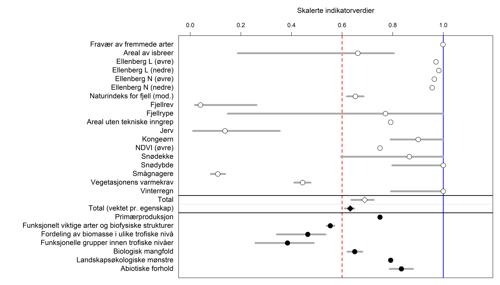

```{r setup, include=FALSE, message=FALSE}
library(knitr)
library(dplyr)
#library(ggplot2)
library(tmap)
library(raster)
#library(fasterize)
library(rgdal)
#library(tmap)
library(sf)
#library(DT)
knitr::opts_chunk$set(echo = TRUE)
```

Sist oppdatert: `r Sys.time()`
<br>


# Introduksjon

Hvilken oppløsning kan vi forvente fra økologisk tilstand?
Kan økologisk tilstand brukes som kunnskapsgrunnlag i arealbrukssaker? Her ser vi på ett konkret eksempel med 12 aktueller prosjektområder/boligområder i Nordre Follo kommune.


[//]: # (importer boligområdene. Shapefil levert av David Barton)
```{r, include=F}
dat <- sf::st_read(dsn = "../data/tolvBoligomraader/UtbyggingsOmråde_polygon.shp")
```

[//]: # (Lager et mindre objekt med omrisset til Nordre Follo)
```{r, eval=F, include=F}
nf <- sf::st_read("R:/GeoSpatialData/AdministrativeUnits/Norway_AdministrativeUnits/Converted/Norway_Municipalities/Kommune_polygon_2020.shp")
nf <- nf[nf$NAVN== "Nordre Follo",]
saveRDS(nf, "../data/outlineNF.rds")
```

[//]: # (Importerer omrisset til Nordre Follo)
```{r, echo=F}
nf <- readRDS("../data/outlineNF.rds")
```

[//]: # (Skru på interaktivt kartmodus)
```{r, include=F}
tmap_mode("view")
```

```{r, fig.width=5, fig.height=7, message=F, echo=F}
tm_basemap(c("OpenStreetMap", "Esri.WorldGrayCanvas", "Esri.WorldTopoMap"))+
tm_shape(nf)+#, bbox = bbox_new)+
  tm_polygons(col = "grey",
              alpha=0.5)+
tm_shape(dat)+
 tm_polygons(col = "NAVN", 
            alpha = .8,
            palette = "viridis",
            legend.show = F)

```

Områdene er spredt rundt i hele kommunen. 

```{r, include=F}
dat$areal <- st_area(dat)
# konverter til km2
dat$areal <- dat$areal/(10^6)
summary(dat$areal)
```

Arealet til prosjektområdene er fra 0.01 til 0.2 km2.

<br>

# Hva er økologisk tilstand

Økologisk tilstand er en holistisk vurdering av økosystemenes intakthet, dvs i hvor stor grad økosystemene er påvirket av mennesker. Tilstanden vurderes ved hjelp av indikatorer. Disse indikatorene skal så langt det er mulig dekke syv egenskaper ved økosystemene

- Funksjonelt viktige arter og biofysiske strukturer
- Fordeling av biomasse i ulike trofiske nivå
- Funksjonelle grupper innen trofiske nivåer
- Biologisk mangfold
- Landskapsøkologiske mønstre
- Abiotiske forhold

Indikatorene bør også oppfylle så mange av de følgende punktene som mulig (liste hentet fra fagsystemet):


1. gi et representativt bilde av miljøets tilstand, miljøpåvirkninger eller samfunnets respons
1. være enkel, lett å tolke og i stand til å vise trender over tid
1. respondere på endringer i miljøet og relaterte menneskelige aktiviteter
1. gi grunnlag for internasjonale sammenligninger
1. være relevant for det arealet som vurderes
1. ha en terskelverdi eller referanseverdi som den kan sammenlignes mot, slik at brukere kan vurdere betydningen av indikatorens verdi 
1. være teoretisk godt fundert i tekniske og vitenskapelige termer
1. være basert på internasjonale standarder og internasjonal konsensus om gyldighet
1. være egnet til å kobles mot økonomiske modeller, prognoser og informasjonssystemer
1. være lett tilgjengelig eller kunne gjøres tilgjengelig på en kostnadseffektiv måte
1. være godt dokumentert og av kjent kvalitet
1. oppdateres jevnlig i samsvar med utarbeidede prosedyrer


Se også [denne artikkelen](https://www.sciencedirect.com/science/article/pii/S1470160X21010414) for andre kriterier til indikatorer.

Dette betyr i praksis at man trenger ganske mange indikatorer for hvert punkt eller areal, og at økolgisk tilstand blir et slags gjennomsnitt av verdien av alle disse. I de nasjonale tilstandsvurderingene har det vært mellom 13 og 19 indikatorer. Her er hovedfiguren fra rapporten om økologisk tilstand i fjell i Norge.



Her er det 19 indikatorer. Merk at de fleste, om ikke alle, av disse indikatorene ikke vil vise noe fornuftig variasjon innad i en kommune. Det kommer blant annet av at det er landskapsøkologiske prosesser som styrer de, eksempelvis tetthetenen av hjortevilt og rovdyr. Klimaderiverte indikatorer, slik som snødybde, vil trolig variere lite. For andre indikatorer finnes det informasjon på en fin skala (eksempelvis NDVI som kommer som 1 x 1 km raster), men at usikkerheten er større enn variasjonen mellom naboceller, slik at man bør unngå å overtolke den finskala variasjonen.

# Utfordringer ved nedskaleringen av økologisk tilstand 

I Nordre Follo skal det gjøres et vegg-til-vegg regnskap, i motsettning til i de nasjonale vurderingene hvor man har gjort ett og ett økosystem om gangen. Det vil si at man i Nordre Follo må ha indikatorer for alle de økosystemene eller arealtypene som finnes der. Som vi ser under så er det ganske mange. 


```{r, cache=T, include=F}
elc <- raster("../data/ELC10_2018_nordreFollo_10m.tif")
```

```{r, include=F}
colElc <- c("#000000",
            "#CC0303",
            "#CDB400",
            "#235123",
            "#B76124",
            "#92AF1F",
            "#F7E174",
            "#2019A4",
            "#AEC3D6")

cats <- c(
  "not mapped",
  "Artificial land",
  "Cropland",
  "Woodland",
  "Shrubland",
  "Grassland",
  "Bare land",
  "Water/permanent snow/ice",
  "Wetland"                 
)

catsNorsk <- c(
  "Ikke kartlagt",
  "Sterkt endret mark",
  "Dyrket mark",
  "Skog",
  "Hei",
  "Eng",
  "Åpen fastmark",
  "Vann eller permanent is",
  "Våtmark"                 
)

catsDF <- data.frame(
  num = seq(0,8,1),
  cat = cats,
  catNorsk = catsNorsk
)
```

```{r, include=F}
tmap_mode("plot")
```


```{r, echo=F, fig.width=5, fig.height=7, message=F, fig.cap="Figur X: Kart over Arealtyper i Nordre Follo kommune."}
tm_shape(elc)+
 tm_raster(
   style = "fixed", 
   breaks = seq(-0.5,8.5,1),
   labels = catsNorsk,
   palette = colElc,
   alpha=1,
   title = "Arealbruk (ELC10) i\nNordre Follo"
   )+
  tm_shape(nf)+
  tm_polygons(col = "grey",
              alpha=0.5)+
tm_layout(title.position = c('right', 'top'),
          legend.position = c("left","bottom"),
          legend.bg.color = "white",
          legend.bg.alpha = .8)
```

Spesielt vannskelig blir det å finne indikatorer for våtmark, sterkt endret mark (inkl. bebygd areal) og semi-naturlig mark.  Realistisk sett vil det ikke bli mulig å få samme indikatordekning på alle arealer, som vi hadde i de nasjonale vurderingene. Samtidig vil oppløsning på den holistiske tilstandsvurderingen, basert på indikatorer som ligner de vi har brukt i de nasjonel tilstandsvurderingen, ikke gi grunnlag for sikkert å skille lokale områder. 


# Eksempler på skalerte karlag

[Tilstand i naturtyper](naturtyperMdir_NordreFollo.html) er en indikator fra datasettet 'Naturtyper etter Miljødirektoratets instruks'. Dette er et eksempel på et frimerkekart. Det er et dekningskart også, som ikke er vist her, men det er ikke mulig utifra det å si noe om tilstanden i arealene som ikke er utfigurert som naturtyper. 

```{r, include=F, message=F}
naturtyper <- st_read("../output/scaledIndicatorMaps/shp/naturtyperMdir.shp")
```
```{r, include=F}
tmap_mode("plot")
```

```{r, fig.width=7, fig.height=7, echo=F}
tm_shape(nf)+
  tm_polygons(col = "grey",
              alpha=0.2)+
tm_shape(naturtyper)+
 tm_polygons(col = "val",
             title = "Tilstand i utvalgte naturtyper",
             legend.hist = TRUE,
             legend.hist.title = "Histogram over tilstandsverdier",
            alpha = 1,
            palette = "RdYlGn",
            legend.show = T)+
   tm_layout(legend.outside = TRUE) 
```

Det neste eksempelet er en [foreløpig indikator](rovdyr_NordreFollo.html) for antall rovdyr. Enn så enge er det bare ulv som er inkludert i denne, mn med tiden vil vi legge til flere. Denne indikatoren dekker hele kommunen, men det er ingen variasjon.
```{r, include=F}
ulv <- readRDS("../output/scaledIndicatorMaps/shp/ulv.rds")
```

```{r, echo=F, fig.width=7, fig.height=7}
tm_shape(ulv)+
  tm_polygons(col = "val",
              title = "Ulv (skalert mot referanseverdi)",
              alpha=1,
              legend.hist = T,
              legend.hist.title = "Histogram over tilstandsverdier",
              palette = "RdYlGn",
              style = "fixed", breaks = seq(0,1,0.2))+
  tm_layout(legend.outside = TRUE)
```

# Veien videre

Ved å følge rådene fra fagsystemet for økologsik tilstand kan vi lage et tilstandsregnskap for Nordre Follo kommune som kan brukes i nasjonal rapportering og i 4-årige kommuneplaner. Dermed fyller vi hovedbehovet som er identifisert i prosjektet.
Men vi ser at det blir vanskelig, om ikke umulig, å bruke samme tilnærming for å lage et høyoppløselig kart over økologisk tilstand som kan brukes i konkrete arealbrukssaker på størrelse med de tolv boligområdene i dette eksempelet. For å dekke dette behovet ser vi for oss følgene tilnærminger.

- Et større fokus på kartfesting av naturgoder. Disse kartene kan ha finere oppløsning. Samtidig kan vi ha et større fokus på fremstilling av variabler som kan forklare eller prediktere naturens evne til å levere naturgoder.

- Et større fokus på fremstilling av kart av ikke-skalerte variabler som er relevante for økologisk tilstand, men som ikke er egnet som indikatorer. Det er derimot usikkert  hvilken grad de er forenlige med et naturregnskap etter SEEA EA. Forvaltningverdien er betraktelig mindre enn for et komplett tilstandsregnskap siden dekningen av de ulike økosystemegenskapene blir mer tilfeldig og datastyrt.

- Lokal finskala naturtypekartlegging og vurdering av et forenklet indikatorsett gjennom *the Biodiversity Metric*, (se [eget notat](notat_okologiskTilstandIFelt.html)).

Det første og siste punktet virker mest fornuftig fra mitt ståsted. Men det vil i alle tilfeller være stort læreutbytte av å gjøre et tilstandsregnskap for hele kommunen etter fagsystemet da dette vil blant annet gi oss øving i kommunikasjon og i sammenstiling av regnskap på tvers av økosystemer. Om vi vil holde på den planen, så kan gjennomføring av det første punktet og andre fjerne viktige ressurser fra denne arbeidsoppgaven.

Forslaget mitt er å lage et *minimum working example* for et vegg-til-vegg tilstandsregnskap i Nordre Follo. Dvs. i praksis at vi reduserer indikatorsettet til et minimum av hva som trengs for å teste funksjonaliteten i regnskapssystemet. Eventuelle midler som blir frigjort av denne reduserte ambisjonsstillingen vil brukes på uttesting av Biodiversity Metric 3.0, siden dette er mer relevant for å dekke kommunens behov for økt kunnskapsgrunnlag i arealbrukssaker. 

