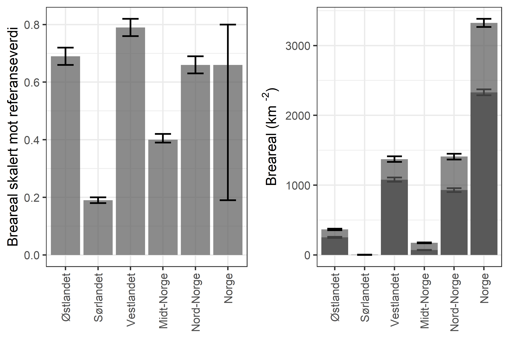
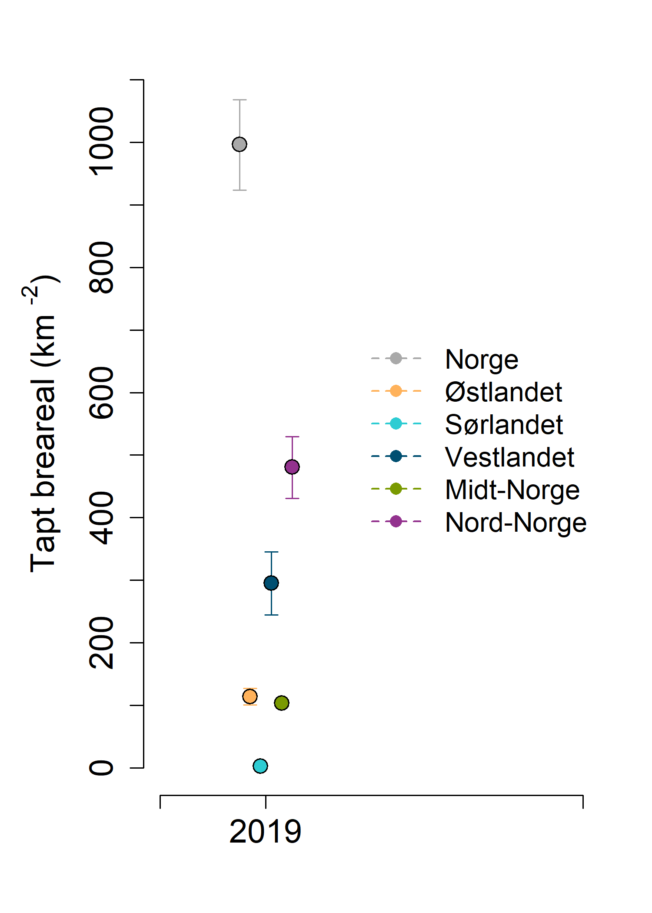

```{r setup, include=FALSE, message=FALSE}
library(knitr)
library(sf)
library(raster) # kunne kanskje byttet til stars
library(dplyr)
library(lwgeom)
library(tmap)
library(dplyr)
library(ggplot2)
library(ggpubr)
knitr::opts_chunk$set(echo = TRUE)
```


# Analyser av breareal

## Importerer data
Det er fire datasett:

* breatlaset
* n50
* regioninndelingen
* omriss av Norge


Vi trenger ikke fjellmasken da vi kan anta at alle isebreer ligger i fjellet.

### Breatlas

Her er det nye breatlasset med breareal fra 2018 og 2019 hentet fra Sentinell (ref Liss Marie Andreassen, NVE)
```{r import1}
#breatlas <- sf::st_read('/data/P-Prosjekter/41201042_okologisk_tilstand_fastlandsnorge_2020_dataanaly/fjell2021/data/breatlas/breatlas_2018_2019/Breatlas_20182019_temp20210922_lma.shp')

breatlas <- sf::st_read('P:/41201042_okologisk_tilstand_fastlandsnorge_2020_dataanaly/fjell2021/data/breatlas/breatlas_2018_2019/Breatlas_20182019_temp20210922_lma.shp')
```

CRS: UTM 33N ETRS89
Det er 6915 polygoner

```{r}
plot(breatlas[1], main = "Breatlas 2018-2019", col = "black")
```

Arealet ser større ut en det er fordi det er lagt på kantlinjer.

```{r breareal}
breatlas$area <- st_area(breatlas)
par(mfrow=c(1,2))
hist(breatlas$area)
plot(breatlas$area)
```

De fleste polygonene er små. Og så er det noen få veldig store. Den største er 50 km2.


### Kart over Norge

```{r import2}
nor <- readRDS('../data/norway_outline.RDS')%>%
  st_as_sf()%>%
  st_transform(crs=crs(breatlas))
plot(nor$geometry, axes=T, main = "Breatlas 2018-2019")
  plot(breatlas$geometry, add=T, border = "blue")

```

UTM33 WGS84


### N50

Her er utstrekningen til breer i perioden 1952 til 1985, basert på gamle kart.
```{r import3}
#n50 <- sf::st_read('/data/P-Prosjekter/41201042_okologisk_tilstand_fastlandsnorge_2020_dataanaly/fjell2021/data/breatlas/n50/cryoclim_GAO_NO_1952_1985_UTM_33N.shp')%>%
#  st_transform(crs = crs(breatlas))

n50 <- sf::st_read('P:/41201042_okologisk_tilstand_fastlandsnorge_2020_dataanaly/fjell2021/data/breatlas/n50/cryoclim_GAO_NO_1952_1985_UTM_33N.shp')%>%
  st_transform(crs = crs(breatlas))

```

```{r}
plot(nor$geometry, axes=T, main = "n50 - 1952-1985")
  plot(n50$geometry, add=T, border = "red")
```

La oss plotte alt sammen oppå hverandre

```{r plotter-alt}

myExt <- raster::extent(c(0, 100000, 6840000, 6900000))
myExt2 <- raster::extent(c(5000, 10000, 6880000, 6885000))

par(mfrow=c(1,3))
plot(nor$geometry, axes=T)
    plot(n50$geometry,  border = "orange", col = scales::alpha("orange", 1), add=T)
    plot(myExt, add=T, lwd=2)

plot(nor$geometry, xlim=c(0, 100000),
          ylim=c(6840000, 6900000),
          axes=T)
    plot(n50$geometry, add=T, col = "grey")
    plot(myExt2, add=T, lwd=3, col="orange")
    
plot(nor$geometry, xlim=c(5000, 10000),
          ylim=c(6880000, 6885000),
     axes=T)
    plot(n50$geometry, add=T, col = "red")
    plot(breatlas$geometry, add=T, col = "grey")
    
```

De røde områdene i kartet til høyre er hvor isen har trekt seg tilbake. 
Nå må vi dele kartlage inn etter regioner for så å sammenligne arealet i n50 med breatlaset. Hvordan vi gjør det med kalkulering av usikkerhet vet jeg fortsatt ikke.


### Regioner
Henter shp med regionene

```{r import4}
#reg <- st_read("/data/P-Prosjekter/41201042_okologisk_tilstand_fastlandsnorge_2020_dataanaly/FINAL/Raw_data/Geografisk_oppdeling/regioner_2010/regNorway_wgs84 - MERGED.shp")%>%
#  st_transform(crs = crs(breatlas))

reg <- st_read("P:/41201042_okologisk_tilstand_fastlandsnorge_2020_dataanaly/FINAL/Raw_data/Geografisk_oppdeling/regioner_2010/regNorway_wgs84 - MERGED.shp")%>%
  st_transform(crs = crs(breatlas))


```


```{r}
plot(nor$geometry, axes=T)
  plot(reg$geometry, add=T, border = "black", 
       col = scales::alpha(c("blue", 
                             "red", 
                             "green",
                             "yellow",
                             "brown"), .2))
```

Før vi henter brearealet inn i tabellen for regionene må jeg prøve å fikse et problem med noen brepolygoner som krysser seg selv
```{r}
table(st_is_valid(breatlas))
```

```{r}
st_is_valid(breatlas, reason=T)[1:10]

```

```{r make-valid}
# krever lwgeom
breatlas2 <- st_make_valid(breatlas)
table(st_is_valid(breatlas2))

# samme resultat:
#breatlas2 <- st_buffer(breatlas, 0.0)
#table(st_is_valid(breatlas2))

```

```{r}
plot(nor$geometry, xlim=c(5000, 10000),
          ylim=c(6880000, 6885000),
     axes=T)
    plot(breatlas2$geometry, add=T, col = scales::alpha("blue",0.5))
    plot(breatlas$geometry, add=T, col = scales::alpha("yellow",0.5))
```

Dette ser ut til å ha funket fint. Denne litt kunstige inndelingen av tilgrensende polygoner er forresten bare i det nye breatlaset, ikke i n50.

```{r}
breatlas <- breatlas2
rm(breatlas2)
```

```{r}
unique(reg$region)
```

Fikser øæå
```{r}
reg$region[reg$region=="Ã\u0098stlandet"] <- "Østlandet"
reg$region[reg$region=="Sørlandet"] <- "Sørlandet"
```

## Breareal per region
### Dagens breer
Her er en metode for å finne breareal per region.

```{r intersection}
#brealtas_reg <- st_intersection(breatlas, reg)
#saveRDS(brealtas_reg, "../data/brealtas_reg_helperfile.rds")
brealtas_reg <- readRDS("../data/brealtas_reg_helperfile.rds")
```
Skjekker hva som skjer med breer som ligger midt mellom to regioner
```{r}
plot(brealtas_reg$geometry[brealtas_reg$region=="Midt-Norge"], 
    col = scales::alpha("red",0.5), border=NA, axes=T, 
     ylim=c(6900000, 6905000),
     xlim=c(85000, 100000))
plot(brealtas_reg$geometry[brealtas_reg$region=="Vestlandet"], 
     col = scales::alpha("green",0.5), border=NA, add=T)
  plot(nor$geometry, add=T)
```

Det deler polygonene ved grensen. Det er bra.

```{r plotting-area-per-region}
brealtas_reg$area_crop <- st_area(brealtas_reg)

bretabell <- tapply(
       brealtas_reg$area_crop,
       brealtas_reg$region,
       FUN = sum)
bretabell <- bretabell/1000000 
barplot(
  bretabell,
  ylab="Breareal (km2)"
)
```
Sørlandet har bare <1km2 med breareal i 2018-2019. 

### Samme for N50
```{r intersection2}
n50x <- st_make_valid(n50)
#n50_reg <- st_intersection(n50x, reg)
#saveRDS(n50_reg, "../data/n50_helperfile.rds")
n50_reg <- readRDS("../data/n50_helperfile.rds")
```

```{r}
plot(n50_reg$geometry[n50_reg$region=="Midt-Norge"], 
    col = scales::alpha("red",0.5), border=NA, axes=T, 
     ylim=c(6900000, 6905000),
     xlim=c(85000, 100000))
plot(n50_reg$geometry[n50_reg$region=="Vestlandet"], 
     col = scales::alpha("green",0.5), border=NA, add=T)
  plot(nor$geometry, add=T)
```

```{r plotting-ref-and-ind}
n50_reg$area_crop <- st_area(n50_reg)

n50tabell <- tapply(
       n50_reg$area_crop,
       n50_reg$region,
       FUN = sum)
n50tabell <- n50tabell/1000000 


barplot(
  n50tabell,
  ylab="Breareal (km2)",
  col="grey"
)
barplot(
  bretabell,
  ylab="Breareal (km2)",
  add=T,
  col="grey30"
)

```

Det var litt mer breareal på Sørlandet i referanseperioden, men bare 4 km2. Tilstanden der blir med andre ord veldig dårlig. 

I figuren over er brearealet i referanseperioden i lyegrått og brearealet i 2018-2019 i mørkegrått. Høyden på det lysegråe partiet viser med andre ord reduksjonen i breareal i denne perioden.

## Skalerte verdier

```{r skalert}
myTbl <- tibble(region          = names(bretabell),
                indikator        = bretabell,
                referanseverdi   = n50tabell)
myTbl$skalert_indikator <- myTbl$indikator/myTbl$referanseverdi
  
```

Skalerer og klipper regionene etter norgeskartet
```{r, message=FALSE}
reg$skalert_indikator <- myTbl$skalert_indikator[match(reg$region, myTbl$region)]
reg_clipped <- st_intersection(reg, nor)
```


```{r}
reg_clipped$skalert_indikator_r <- round(reg_clipped$skalert_indikator, 2)
tmap_mode("view")
tm_shape(reg_clipped) + 
  tm_polygons(col="skalert_indikator", border.col = "white")+
  tm_text("skalert_indikator_r", size=1.5)+
  tm_shape(nor)+
  tm_polygons(alpha = 0,border.col = "black")

```


Det er 4 måter å kalkulere den nasjonale indikatorverdien på:

1) ta gjennomsnitt av de skalerte regionale indikatorverdiene og la alle regionene telle likt (regional skaleringsmetode)
```{r}
(alt1 <- mean(reg_clipped$skalert_indikator))
```

2) summer indikatorverdien for hele landet og del på den summerte referanseverdien for hele landet (nasjonal metode)
```{r}
(alt2 <- sum(bretabell)/sum(n50tabell))
```


3) summere skalerte regionale indikatorverdier etter å ha gitt de ulike vekt grunnet totalarealet til regionen (arealveid metode)

```{r}
reg_clipped$areal <- st_area(reg_clipped$geometry)/1000000

totalArea <- sum(reg_clipped$areal)

reg_clipped$skalert_indikator_v <- reg_clipped$skalert_indikator*
  reg_clipped$areal


sumSkalerteIndikatorer <- sum(reg_clipped$skalert_indikator_v)

(alt3 <- sumSkalerteIndikatorer/totalArea)
```
4) summere skalerte regionale indikatorverdier etter å ha gitt de ulike vekt grunnet fjellareal (fjellarealveid metode)


For dette trenger jeg [fjellareal per region](fjellareal-per-region.html):
```{r}
(fjellareal <- readRDS("../data/fjellareal.rds"))
```


```{r}
reg_clipped$fjellareal <- fjellareal$Fjellareal[match(reg_clipped$region, fjellareal$Region)]
reg_clipped$skalert_indikator_v2 <- reg_clipped$skalert_indikator*
  reg_clipped$fjellareal
(alt4 <- sum(reg_clipped$skalert_indikator_v2)/sum(reg_clipped$fjellareal))
```
Her er alternativene oppsummert:

1. Indeksverdi `r round(alt1, 2)`. Aggregeringsmetoden er tvilsom.

2. Indeksverdi `r round(alt2, 2)`. Aggregeringsmetoden sier oss hvordan den TOTALE endringen i breareal har vært for Norge sett under ett.

3. Indeksverdi `r round(alt3, 2)`. Aggregeringsmetoden er igjen tvilsom.

4. Indeksverdi `r round(alt4, 2)`. Aggregeringsmetoden sier oss hvordan den GJENNOMSNITTLIGE endringen i breareal har vært for Norge sett under ett (jf metoden i NI).

Her kan det diskuteres hva som egentlig er best, men vi har valgt å gå for alt 4 for å være konsistent med SEEA EA bl.a. Indikatorverdien for Norge er da 0.62. 

## Usikkerhet
NVE oppgir 3% usikkerhet ved metoden. Dette tolker jeg som at +- 3 er %99.9%CI for estimatet. Dvs ca 2 SD
```{r}
reg <- c("N", "C", "E", "W", "S")
myTbl$reg <- c("C", "N", "S", "W", "E")

breTbl <- data.frame(
  reg = rep(reg, each=1000),
  indikatorverdi = NA,
  refVerdi = NA,
  val = NA
)
breTbl2 <- breTbl

for(i in reg){
  #print(i)
  temp <- breTbl2[breTbl2$reg==i,]
  temp$indikatorverdi <- rnorm(1000, myTbl$indikator[myTbl$reg==i], 1.5)
  temp$refVerdi <- rnorm(1000, myTbl$referanseverdi[myTbl$reg==i], 1.5)
  breTbl$indikatorverdi[breTbl$reg==i] <- temp$indikatorverdi
  breTbl$refVerdi[breTbl$reg==i] <- temp$refVerdi
}

breTbl$indikatorverdi[breTbl$indikatorverdi<0] <- 0
breTbl$refVerdi[breTbl$refVerdi<0] <- 0

breTbl$val <- breTbl$indikatorverdi/breTbl$refVerdi
breTbl$unscaledVal <- breTbl$refVerdi-breTbl$indikatorverdi
#breTbl <- dplyr::select(breTbl, -refVerdi)
breTbl$year <- 2019
```
Her må jeg trunkere fordi sd-funksjonen kan gi verdier under null, samt at tiltand kan bli over 1 om brearealet har økt.

```{r}
breTbl$val[breTbl$val<0] <- 0
breTbl$val[breTbl$val>1] <- 1
```

Så må jeg finne den nasjonale tilstanden. 

```{r}
breNorge <- data.frame(
  reg = rep("Norge", 10000),
  indikatorverdi = NA,
  refVerdi = NA,
  val = NA,
  unscaledVal = NA,
  year = 2019
)

# Legger inn vektene på nytt
wgt <- readRDS("../data/fjellareal.rds")
wgt$Fjellareal2 <- wgt$Fjellareal/max(wgt$Fjellareal)
wgt$reg <- c("N", "C", "E", "W", "S")


temp <- breTbl
    
temp2 <- c(
      sample(temp$val[temp$reg == "N"], wgt$Fjellareal2[wgt$reg == "N"]*1000, replace =T),
      sample(temp$val[temp$reg == "E"], wgt$Fjellareal2[wgt$reg == "E"]*1000, replace =T),
      sample(temp$val[temp$reg == "W"], wgt$Fjellareal2[wgt$reg == "W"]*1000, replace =T),
      sample(temp$val[temp$reg == "S"], wgt$Fjellareal2[wgt$reg == "S"]*1000, replace =T),
      sample(temp$val[temp$reg == "C"], wgt$Fjellareal2[wgt$reg == "C"]*1000, replace =T)
    )

for(i in 1:10000){
 
  breNorge$unscaledVal[i] <- 
    sum(
      sample(temp$unscaledVal[temp$reg == "N"],1),
      sample(temp$unscaledVal[temp$reg == "E"],1),
      sample(temp$unscaledVal[temp$reg == "W"],1),
      sample(temp$unscaledVal[temp$reg == "S"],1),
      sample(temp$unscaledVal[temp$reg == "C"],1))
}

breNorge$val <- sample(temp2, 10000, replace=T)
breTbl <- rbind(breTbl, breNorge)

```

```{r}
eval(parse("indicator_plots2.R", encoding="UTF-8"))
```

```{r, message=F, eval=F}
png("../output/indicatorPlots/breareal.png", 
    units="in", width=5, height=7, res=300)

par(mfrow=c(1,1), mar=c(4.5,
                        5.5,
                        0,
                        2))

indicator_plot2(dataset = dplyr::select(breTbl, reg, year, val),
               yAxisTitle = "Breareal skalert mot referanseverdi",
               lowYlimit = 0,
               upperYlimit = 1,
               yStep = .2,
               minyear = 2018,
               maxyear = 2022,
               colours = c("#FFB25B", "#2DCCD3", "#004F71", "#7A9A01", "#93328E", "dark grey"),
               legendPosition = "right",
               legendInset = 0,
               move = 0.1,
               horizontal = F,
               legendTextSize = 1.25)
dev.off()

png("../output/indicatorPlots/breareal_uskalert.png", 
    units="in", width=5, height=7, res=300)

par(mfrow=c(1,1), mar=c(4.5,
                        5.5,
                        2,
                        2))
indicator_plot2(dataset = dplyr::select(breTbl, reg, year, val = unscaledVal),
               yAxisTitle = expression(paste("Tapt breareal (km "^"-2"*")")),
               lowYlimit = 0,
               upperYlimit = 1100,
               yStep = 100,
               minyear = 2018,
               maxyear = 2022,
               colours = c("#FFB25B", "#2DCCD3", "#004F71", "#7A9A01", "#93328E", "dark grey"),
               legendPosition = "right",
               legendInset = 0,
               move = 0.1,
               horizontal = F,
               legendTextSize = 1.25)
dev.off()
```

# Oppsummering


```{r, echo=F}

finalTbl <- aggregate(data=breTbl,
          val~year+reg,
          FUN= function(x) round(
            quantile(x, c(.025, .5, .975)), 2))

finalTbl <- do.call(data.frame, finalTbl)
names(finalTbl) <- c("year", "reg", "low", "med", "upp")

DT::datatable(
  finalTbl, 
  extensions = "FixedColumns",
  options = list(
    scrollX = TRUE,
    scrollY=T,
    pageLength = 10
  ))
```


```{r}
finalTbl2 <- aggregate(data=breTbl,
          indikatorverdi~year+reg,
          FUN= function(x) round(
            quantile(x, c(.025, .5, .975)), 2))

finalTbl2 <- do.call(data.frame, finalTbl2)
names(finalTbl2) <- c("year", "reg", "val_low", "val_med", "val_upp")

finalTbl3 <- aggregate(data=breTbl,
          refVerdi~year+reg,
          FUN= function(x) round(
            quantile(x, c(.025, .5, .975)), 2))

finalTbl3 <- do.call(data.frame, finalTbl3)
names(finalTbl3) <- c("year", "reg", "ref_low", "ref_med", "ref_upp")

finalTbl4 <- cbind(finalTbl2, finalTbl3[,3:5])
```

```{r, eval=F}
myReg <- c("E", "S", "W", "C", "N", "Norge")
labs = c("Østlandet","Sørlandet","Vestlandet","Midt-Norge","Nord-Norge","Norge")


bar <- ggplot(finalTbl)+
  geom_bar(aes(x=factor(reg, level = myReg), y=med), stat="identity", alpha=0.7)+
  geom_errorbar(aes(x=factor(reg, level = myReg), y=med, ymin = low, ymax=upp),
                width=0.5,
                size=1.2)+
  ylab("Breareal skalert mot referanseverdi")+
  xlab("")+
  scale_x_discrete(breaks = myReg,
                   labels= labs)+
  
  theme_bw(base_size = 20)+
  theme(
    axis.text.x = element_text(angle = 90, vjust = 0.5, hjust=1)
  )

(barSTacked <- ggplot(finalTbl4)+
  geom_bar(aes(x=factor(reg, level = myReg), y=val_med), 
           stat="identity")+
  geom_errorbar(aes(x=factor(reg, level = myReg), 
                    y=val_med, ymin = val_low, ymax=val_upp),
                width=0.5,
                size=1.2)+
    
  geom_bar(aes(x=factor(reg, level = myReg), y=ref_med), 
           stat="identity", alpha=0.7)+
  geom_errorbar(aes(x=factor(reg, level = myReg), 
                    y=ref_med, ymin = ref_low, ymax=ref_upp),
                width=0.5,
                size=1.2)+
    
  ylab(expression(paste("Breareal (km "^"-2"*")")))+
  xlab("")+
  scale_x_discrete(breaks = myReg,
                   labels= labs)+
  theme_bw(base_size = 20)+
  theme(
    axis.text.x = element_text(angle = 90, vjust = 0.5, hjust=1)
  ))

figure <- ggarrange(bar, barSTacked,
                    ncol = 2)


png("../output/indicatorPlots/breareal_barplot.png", 
    units="in", width=10, height=7, res=300)
figure
dev.off()
```






