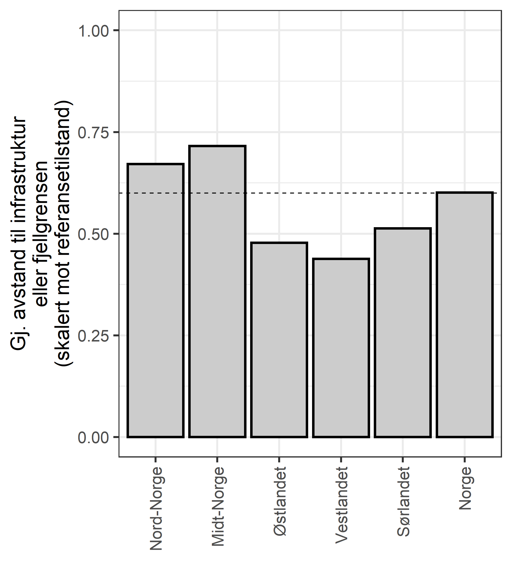
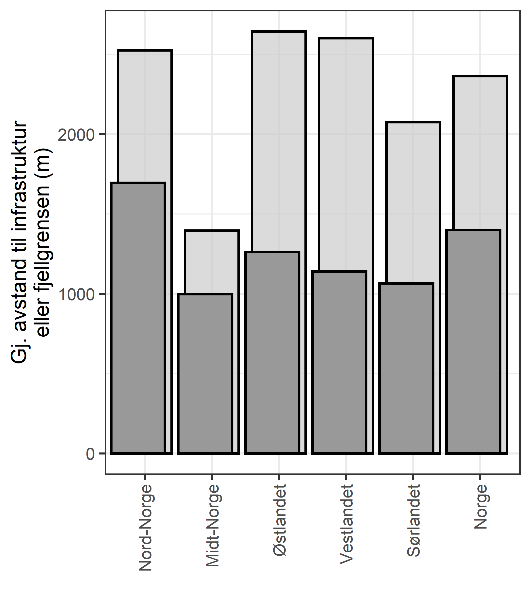

```{r setup, include=FALSE, message=FALSE}
library(knitr)
library(DT)
library(NIcalc)
library(dplyr)
library(ggplot2)
knitr::opts_chunk$set(echo = TRUE)
```

Her regner vi ut gjennomsnittlig avstand fra en fjellpiksel til menneskelig infrastruktur eller til grensen av fjelmasken (ofte skog). Denne verdien regnes ut for hver region og sammenlignes dette med den samme avstanden gitt at det ikke er noen mennekslig infrastruktur. Analysene er gjort av Stefan Blumentrath.

# Shell
Skriptet under beregner univariat statistikk for avstand til boreal (f.eks. skog) og menneskelig innflytelse
```{r, eval=F}
# Forutsetter at IBECA er arbeidsmappen setwd("~/IBECA/R")
system("grass --tmp-location EPSG:25833 --exec bash ../data/fjell_trussel_dist_stats.sh")
```

# Import CSV
Importerer og formater resulterende data
```{r}
library(readr)
ind <- read_csv("../data/fjell_trussel_dist_stats.csv", 
    col_types = cols(zone = col_integer(), 
        non_null_cells = col_integer(), null_cells = col_integer()))
ref <- read_csv("../data/fjell_trussel_dist_referanse_stats.csv", 
    col_types = cols(zone = col_integer(), 
        non_null_cells = col_integer(), null_cells = col_integer()))

```

```{r}
dat <- select(ind, zone, mean, stddev)
dat$ref <- ref$mean[match(dat$zone, ref$zone)]
```

Fikser regionnavn
```{r}
dat$zone <- as.factor(dat$zone)
dat$zone <- plyr::revalue(dat$zone,
                        c("1" = "N",
                          "2" = "C",
                          "3" = "E",
                          "4" = "W",
                          "5" = "S"))
```

Skalerer til ref- verdi
```{r}
dat$val <- dat$mean/dat$ref
```

Finner nasjonal verdi basert på et arealvektet gjennomsnitt

Fjellareal per region:
```{r}
wgt <- readRDS("../data/fjellareal.rds")
wgt$Fjellareal2 <- wgt$Fjellareal/max(wgt$Fjellareal)
wgt$reg <- c("N", "C", "E", "W", "S")
```

```{r}
dat$wgt <- wgt$Fjellareal2[match(dat$zone, wgt$reg)]
```

```{r}
dat[nrow(dat)+1, "val"] <- weighted.mean(dat$val, dat$wgt)
```

```{r}
dat$reg <- as.character(dat$zone)
dat[nrow(dat), "reg"]  <- "Norge"
```

```{r}
dat$label <- dat$reg
dat$label <- plyr::revalue(dat$reg,
                        c("N" = "Nord-Norge",
                          "C" = "Midt-Norge",
                          "E" = "Østlandet",
                          "W" = "Vestlandet",
                          "S" = "Sørlandet"))
```

```{r}
regOrder = c(
  "Nord-Norge",
  "Midt-Norge",
  "Østlandet",
  "Vestlandet",
   "Sørlandet",
  "Norge"
             )
```

# Plot
```{r}
ggFrag <- ggplot(data = dat, aes(x = factor(label, levels = regOrder), y = val))+
  geom_bar(stat="identity", alpha=.8)+
  ylim(0,1)+
  ylab("Gj. avstand til infrastruktur\neller fjellgrensen\n(skalert mot referansetilstand)")+
  xlab("")+
  geom_hline(yintercept = 0.6, linetype = "dashed")+
  theme_bw(base_size = 20)+
  theme(
      axis.text.x = element_text(angle = 90, vjust = 0.5, hjust=1))
```

```{r, eval=F}
png("../output/indicatorPlots/skalert/fragmentering barplot skalert.png", 
    units="in", width=5, height=8, res=300)
ggFrag
dev.off()
```


Her er hvordan det ser ut uskalert der y-aksen er i meter
```{r}
dat[nrow(dat), "mean"] <- weighted.mean(dat$mean, dat$wgt, na.rm=T)
dat[nrow(dat), "ref"] <- weighted.mean(dat$ref, dat$wgt, na.rm=T)
```

```{r}
gg <- ggplot()+
  geom_bar(data = dat, aes(x = factor(label, levels = regOrder), y = ref),
           stat = "identity", alpha = .7, width=.8)+
  geom_bar(data = dat, aes(x = factor(label, levels = regOrder), y = mean),
           stat = "identity", alpha = 1, colour="black",
           position = position_nudge(x=-0.1),
           width=.8)+
  theme_bw(base_size = 20)+
  ylab("Gj. avstand til infrastruktur\neller fjellgrensen (m)")+
  xlab("")+
  theme(
      axis.text.x = element_text(angle = 90, vjust = 0.5, hjust=1))
```

```{r, eval=F}
png("../output/indicatorPlots/supporting figures/fragmentering barplot.png", 
    units="in", width=7, height=8, res=300)
gg
dev.off()
```



# Eksporter csv
```{r}
datExp <- select(dat, reg, val)
datExp$X <- "fragmentering"
datExp$year <- 2021
datExp
```


```{r, eval=F}
write.csv(datExp, "../output/indicator_values/fragmentering.csv", row.names = F)
```
