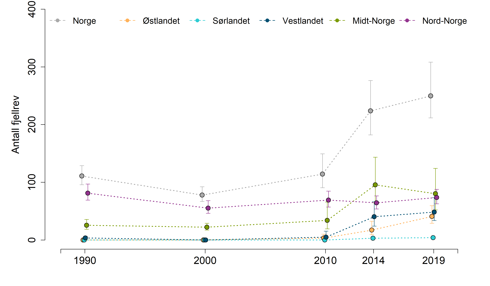

```{r setup, include=FALSE, message=FALSE}
library(knitr)
library(DT)
library(NIcalc)
library(dplyr)
library(ggplot2)
library(data.table)
knitr::opts_chunk$set(echo = TRUE)
```

# Import

Data er allerede hentet ned fra NI-databasen av Simon.
```{r, eval =FALSE}
fjellrev <- read_csv("output/indicator_values/fjellrev.csv")
```

Men han har brukt arealvekting av basal units, og det tror jeg blir feil. Jeg vil helst gjøre det likt som for jerv.

Fyll inn ditt eget passord og brukernavn
```{r}
myUser <- "anders.kolstad@nina.no"
myPwd  <- "" # hemmelig passord
```


Importerer data fra NI-databasen og lagrer datasettet på server
```{r import, eval=F}

rev <- NIcalc::importDatasetApi(
  username = myUser,
  password = myPwd,
  eco = "Fjell", 
  indic = "Fjellrev",
  year = c(1990,2000,2010,2014,2019))
saveRDS(jerv, "../data/fjellrevNIexport.rds")

```


```{r}
rev <- readRDS("../data/fjellrevNIexport.rds")
```

Spesifiser hele landarealet til Norge, samt de tre regionene, som NIunits:
```{r}
myNIunits <- c(allArea = T, parts = T, counties = F)
```

Inkludrer alle BSunits (kommuner):
```{r}
myPartOfTotal <- 0
```


Siden denne opperasjonen tar litt tid så lagrer jeg outputen på server og henter det tilbake etterpå, så slipper jeg å kjøre gjennom hver gang.
```{r, eval=FALSE}
rev_assemeble <- NIcalc::assembleNiObject(
  inputData = rev,
  predefNIunits = myNIunits, 
  partOfTotal = myPartOfTotal, 
  indexType = "thematic",
  part = "ecosystem",
  total = "terrestrial")  
saveRDS(jerv_assemeble, "../data/rev_assemble.rds")

```

```{r}
rev_assemeble <- readRDS("../data/rev_assemble.rds")
```

Her er tanken å gjøre det samme som for jerv-indikatoren og simulere n verdier fra sannsynelighetsfunksjonen til indikatoren. Jeg bruker tradObs der det er en vanlig fordelingsfamilie, og customObs der custumDist!= NA. Når distributionFamilyName == NA så er customDistribution != NA
```{r}
myYears <- as.character(c(1990,2000,2010,2014,2019))
obstype <- NULL

for(i in 1:length(myYears)){
  
  obs <- rev_assemeble$indicatorValues[[i]]$distributionFamilyName
  
  obs[!is.na(obs)] <- "tradObs"
  obs[is.na(obs)]  <- "customObs"
  
  obstype[[i]] <- obs
  }
```

```{r}
for(i in 1:length(myYears)){
# print(i)
  myMat <- NIcalc::sampleObsMat(
   ICunitId           = rev_assemeble$indicatorValues[[i]]$ICunitId, 
   value              = rev_assemeble$indicatorValues[[i]]$expectedValue,
   distrib            = rev_assemeble$indicatorValues[[i]]$distributionFamilyName,
   mu                 = rev_assemeble$indicatorValues[[i]]$distParameter1,
   sig                = rev_assemeble$indicatorValues[[i]]$distParameter2,
   customDistribution = rev_assemeble$indicatorValues[[i]]$customDistribution,
   obsType            = obstype[[i]],
   nsim               = 1000
          
)
assign(paste0("myMat", myYears[i]), myMat)
}

```

Radene i denne matrisen er ICunitIDs. Jeg kan knytte de til navnene og fra navnene til NIunits.


```{r}
link <- as.data.frame(rev_assemeble$NIunits) %>%
  select(-wholeArea)

link$ICunit <- row.names(link)  
setDT(link) # data.table likes to use data tables
link <- data.table::melt(link,
                  id.vars="ICunit"
                  )

link <- link[link$value >0,]                     
link <- select(link, -value)
anyDuplicated(link$ICunit)
names(link)[2] <- "region"

link2 <- as.data.frame(rev_assemeble$ICunits)
names(link2) <- "ICunitNameID"
link2$ICunitName <- row.names(link2)
link$ICunitID <- link2$ICunitNameID[match(link$ICunit, link2$ICunitName)]
head(link)
```

```{r}
nord <- link$ICunitID[link$region=="N"]
midt <- link$ICunitID[link$region=="C"]
vest <- link$ICunitID[link$region=="W"]
sør <-  link$ICunitID[link$region=="S"]
øst <-  link$ICunitID[link$region=="E"]
```


# Referanseverdier
Referanseverdiene er de samme for hvert år og alle har custumDistribution
```{r}
obstype <- rep("customObs", nrow(rev_assemeble$referenceValues))

myMatr <- NIcalc::sampleObsMat(
  ICunitId           = rev_assemeble$referenceValues$ICunitId, 
  value              = rev_assemeble$referenceValues$expectedValue,
  distrib            = rev_assemeble$referenceValues$distributionFamilyName,
  mu                 = rev_assemeble$referenceValues$distParameter1,
  sig                = rev_assemeble$referenceValues$distParameter2,
  customDistribution = rev_assemeble$referenceValues$customDistribution,
  obsType            = obstype,
  nsim =1000
        )

```
Antall fjellrev for hele Norge i refereansetilstand:
```{r}
mean(colSums(myMatr))
```


Først regner jeg ut uskalerte verdier for regionene

```{r}
regions <- c("Norge", "N", "C", "W", "S", "E")

revTbl_unscaled <- data.frame(
  reg = rep(regions, each=length(myYears)),
  year = rep(myYears, length(regions)),
  low = NA,
  med = NA,
  upp = NA
)

for(i in regions){
  
   for(n in myYears){
     
     tempMat <- get(paste0("myMat", n))
     tempMat <- as.data.frame(tempMat)
     myMatrX <- as.data.frame(myMatr)
     
     if(i == "N") tempMat <- tempMat[row.names(tempMat) %in% nord,] 
     if(i == "C") tempMat <- tempMat[row.names(tempMat) %in% midt,] 
     if(i == "W") tempMat <- tempMat[row.names(tempMat) %in% vest,] 
     if(i == "S") tempMat <- tempMat[row.names(tempMat) %in% sør,] 
     if(i == "E") tempMat <- tempMat[row.names(tempMat) %in% øst,] 
     
     if(i == "N") myMatrX <- myMatrX[row.names(myMatrX) %in% nord,] 
     if(i == "C") myMatrX <- myMatrX[row.names(myMatrX) %in% midt,] 
     if(i == "W") myMatrX <- myMatrX[row.names(myMatrX) %in% vest,] 
     if(i == "S") myMatrX <- myMatrX[row.names(myMatrX) %in% sør,] 
     if(i == "E") myMatrX <- myMatrX[row.names(myMatrX) %in% øst,] 
     
     revTbl_unscaled[revTbl_unscaled$reg==i & revTbl_unscaled$year==n, 3:5] <- 
       quantile(colSums(tempMat), c(0.025, .5, .975))

     
 }
    
}
  
```

```{r}
eval(parse("indicator_plots.R", encoding="UTF-8"))
eval(parse("indicator_plots2.R", encoding="UTF-8"))
```

# Plotter uskalerte verdier

```{r, message=F}
png("../output/indicatorPlots/fjellrev_uskalert.png", 
    units="in", width=12, height=7, res=300)

par(mfrow=c(1,1), mar=c(4.5,
                        5.5,
                        0,
                        2))

indicator_plot(dataset = revTbl_unscaled,
               yAxisTitle = "Antall fjellrev",
               lowYlimit = 0,
               upperYlimit = 400,
               yStep = 100,
               minyear = 1988,
               maxyear = 2021,
               colours = c("#FFB25B", "#2DCCD3", "#004F71", "#7A9A01", "#93328E", "dark grey"),
               legendPosition = "top",
               legendInset = 0,
               move = 0.1,
               horizontal = T,
               legendTextSize = 1.25)
dev.off()
```
# Skalerte verdier
Nå regner jeg ut skalerte indikatorverdier.

```{r}
regions <- c("N", "C", "W", "S", "E")

revTbl2 <- data.frame(
  reg = rep(regions, each=length(myYears)*1000),
  year = rep(myYears, each = 1000, times=length(regions)),
  val = NA
)


for(i in regions){
  
   for(n in myYears){
     
     # Get the right year
     tempMat <- get(paste0("myMat", n))
     tempMat <- as.data.frame(tempMat)
     myMatrX <- as.data.frame(myMatr)
    

     # get the right rows (regions)
     if(i == "N") tempMat <- tempMat[row.names(tempMat) %in% nord,] 
     if(i == "C") tempMat <- tempMat[row.names(tempMat) %in% midt,] 
     if(i == "W") tempMat <- tempMat[row.names(tempMat) %in% vest,] 
     if(i == "S") tempMat <- tempMat[row.names(tempMat) %in% sør,] 
     if(i == "E") tempMat <- tempMat[row.names(tempMat) %in% øst,] 
     
     if(i == "N") myMatrX <- myMatrX[row.names(myMatrX) %in% nord,] 
     if(i == "C") myMatrX <- myMatrX[row.names(myMatrX) %in% midt,] 
     if(i == "W") myMatrX <- myMatrX[row.names(myMatrX) %in% vest,] 
     if(i == "S") myMatrX <- myMatrX[row.names(myMatrX) %in% sør,] 
     if(i == "E") myMatrX <- myMatrX[row.names(myMatrX) %in% øst,] 

     # Scale
     tempMatScaled <- colSums(tempMat)/colSums(myMatrX)
     
     # add 1000 observations to the dataframe
     revTbl2[revTbl2$reg==i & revTbl2$year==n, "val"] <- tempMatScaled
     
     
 }
    
}
  
```

# Veiing
Regner ut nasjonale indikatorverider som et veid (etter total fjelareal) gjennomsnitt av vedien i regionene. Veiingen gjøres ved å samle større antall verdier for de regionene som har mest fjell i seg.
```{r}
wgt <- readRDS("../data/fjellareal.rds")
wgt$Fjellareal2 <- wgt$Fjellareal/max(wgt$Fjellareal)
wgt$reg <- c("N", "C", "E", "W", "S")
```

```{r}
revNorge <- data.frame(
  reg = rep("Norge", 5000),
  year = rep(myYears, each = 200, times=length(regions)),
  val = NA
)

for(n in myYears){
    temp <- revTbl2[revTbl2$year == n,]
    
    temp2 <- c(
      sample(temp$val[temp$reg == "N"], wgt$Fjellareal2[wgt$reg == "N"]*1000, replace =T),
      sample(temp$val[temp$reg == "E"], wgt$Fjellareal2[wgt$reg == "E"]*1000, replace =T),
      sample(temp$val[temp$reg == "W"], wgt$Fjellareal2[wgt$reg == "W"]*1000, replace =T),
      sample(temp$val[temp$reg == "S"], wgt$Fjellareal2[wgt$reg == "S"]*1000, replace =T),
      sample(temp$val[temp$reg == "C"], wgt$Fjellareal2[wgt$reg == "C"]*1000, replace =T)
    )
    
    revNorge$val[revNorge$year == n] <- sample(temp2, 1000)
}
```

```{r}
revTbl2 <- rbind(revTbl2, revNorge)
```

# Plotting
```{r, message=F}
png("../output/indicatorPlots/fjellrev.png", 
    units="in", width=12, height=7, res=300)

par(mfrow=c(1,1), mar=c(4.5,
                        5.5,
                        0,
                        2))

indicator_plot2(dataset = revTbl2,
               yAxisTitle = "Antall fjellrev skalert mot referanseverdi",
               lowYlimit = 0,
               upperYlimit = 1,
               yStep = .2,
               minyear = 1988,
               maxyear = 2021,
               colours = c("#FFB25B", "#2DCCD3", "#004F71", "#7A9A01", "#93328E", "dark grey"),
               legendPosition = "top",
               legendInset = 0,
               move = 0.1,
               horizontal = T,
               legendTextSize = 1.25)
dev.off()
```


# Oppsummering




Under er tabellen med skalerte verdier for hvert år og region (med = median, og det er det som er 'tilstanden')

```{r}

finalTbl <- aggregate(data=revTbl2,
          val~year+reg,
          FUN= function(x) round(
            quantile(x, c(.025, .5, .975)), 2))

finalTbl <- do.call(data.frame, finalTbl)
names(finalTbl) <- c("year", "reg", "low", "med", "upp")

DT::datatable(
  finalTbl, 
  extensions = "FixedColumns",
  options = list(
    scrollX = TRUE,
    scrollY=T,
    pageLength = 10
  ))
```

# Eksporter csv

```{r, eval=F}
write.csv(revTbl2, "../output/indicator_values/fjellrev.csv", row.names = F)
```
