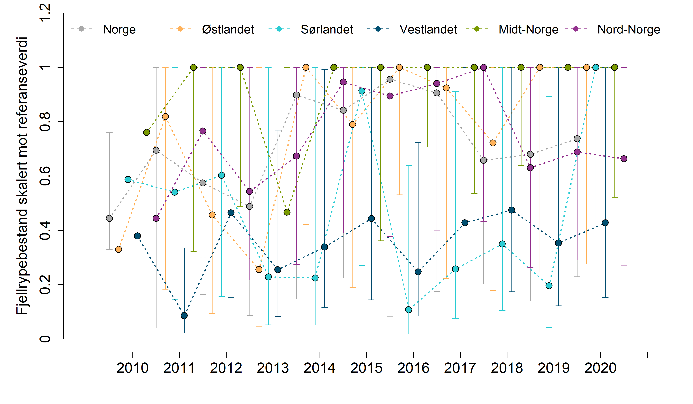

```{r setup, include=FALSE, message=FALSE}
library(knitr)
library(readxl)
library(DT)
library(data.table)
library(ggplot2)
library(ggpubr)
library(dplyr)
library(plyr)
knitr::opts_chunk$set(echo = TRUE)
```


[Klikk her](TRIM-Fjellrype.html) for å se starten på utregningen av indiatorverdien som ble gjort av Markus F Israelsen.

På denne siden gjør jeg de siste stegene i analysen og viser resultatene.

# Import
```{r}
dat <- read_excel("../output/indicator_values/fjellrype.xlsx")
head(dat)
```

Dette er bootstrappede indikatorverdier, skalerte mot indeksåret 2010.

La oss få dette over i langt format.
```{r}
setDT(dat)
dat <- melt(dat,
            id.vars = 'Region')
head(dat)
```

```{r}
names(dat) <- c("reg", "year", "value")
table(dat$reg, dat$year)
```
10 000 verdier per kombinasjon.

Gir regionene nytt navn.
```{r}
unique(dat$reg)

dat$reg <- plyr::revalue(dat$reg,
      c("nord"="N", 
        "midt"="C",
        "øst" ="E",
        "vest"="W",
        "sør"="S"))
```

```{r}
plot(dat$value)
```

Det er mange høye verdier. En verdi på 2 tilsier 2x så mange ryper som i 2010.

```{r}
dat$year <- as.numeric(as.character(dat$year))
ggplot(data=dat, aes(x = year, y = value, group= reg, colour = reg))+
  geom_smooth()
```

Det har vært en bedring i bestandedn i de siste årene. Østlandet har noen store svingninger.

Nå må vi skalere dataene etter en referansetilstand, som vi henter fra Naturindeksen. Der er det oppgitt hvor stor prosentanndel av referasnetilstanden som var realisert i 2010.

# Henter referansetilstand
Fyll inn ditt eget passord og brukernavn
```{r}
myUser <- "anders.kolstad@nina.no"
myPwd  <- "" # hemmelig passord
```


Importerer data fra NI-databasen
```{r import, eval=F}

ref <- NIcalc::importDatasetApi(
  username = myUser,
  password = myPwd,
  eco = "Fjell", 
  indic = "Fjellrype",
  year = c(2010))
saveRDS(ref, "../data/fjellrypeNIexport.rds")

```
```{r}
ref <- readRDS("../data/fjellrypeNIexport.rds")
```


```{r}
ref2 <- ref$referenceValues$referenceValues
ref2 <- select(ref2, ICunitName, expectedValue)
```
Det er usikkerhet knyttet til referanseverdiene, men her behandler jeg dem som faste.

```{r}
comp <- ref$indicatorObservations$indicatorValues
comp <- select(comp, ICunitName, expectedValue)
ref2$comp <- comp$expectedValue[match(ref2$ICunitName, comp$ICunitName)]
head(ref2)
```

Så må jeg summere bestandsestimate for hver region
```{r}
ref2$reg <- NA
ref2$reg[ref2$ICunitName == "Hedmark" |
          ref2$ICunitName == "Oppland"|
           ref2$ICunitName == "Buskerud"] <- "E"

ref2$reg[ref2$ICunitName == "Telemark" |
          ref2$ICunitName == "Aust-Agder"|
           ref2$ICunitName == "Vest-Agder"] <- "S"

ref2$reg[ref2$ICunitName == "Rogaland" |
          ref2$ICunitName == "Hordaland"|
           ref2$ICunitName == "Sogn og Fjordane"] <- "W"


ref2$reg[ref2$ICunitName == "Møre og Romsdal" |
          ref2$ICunitName == "Sør-Trøndelag"|
           ref2$ICunitName == "Nord-Trøndelag"] <- "C"

ref2$reg[ref2$ICunitName == "Nordland" |
          ref2$ICunitName == "Troms"|
           ref2$ICunitName == "Finnmark"] <- "N"

```
```{r}
ref3 <- aggregate(data=ref2,
                  expectedValue~reg,
                  FUN = sum)
temp <- aggregate(data=ref2,
                  comp~reg,
                  FUN = sum)
ref3$comp <- temp[,2]
ref3$realisert <- ref3$comp/ref3$expectedValue
```

## Skalerer TRIMverdiene mot referansetilstand
```{r}
dat$factor <- ref3$realisert[match(dat$reg, ref3$reg)]
dat$val <- dat$value*dat$factor
# trunkerer
dat$val[dat$val >1] <- 1
```

# Veiing
Regner ut nasjonale indikatorverider som et veid (etter total fjellareal) gjennomsnitt av vedien i regionene. Veiingen gjøres ved å samle større antall verdier for de regionene som har mest fjell i seg.
```{r}
wgt <- readRDS("../data/fjellareal.rds")
wgt$Fjellareal2 <- wgt$Fjellareal/max(wgt$Fjellareal)
wgt$reg <- c("N", "C", "E", "W", "S")
```

```{r}
myYears <- 2010:2020

datNorge <- data.frame(
  reg = rep("Norge", 110000),
  year = rep(2010:2020, each = 10000),
  val = NA
)

for(n in myYears){
    temp <- dat[dat$year == n,]
    
    temp2 <- c(
      sample(temp$val[temp$reg == "N"], wgt$Fjellareal2[wgt$reg == "N"]*10000, replace =T),
      sample(temp$val[temp$reg == "E"], wgt$Fjellareal2[wgt$reg == "E"]*10000, replace =T),
      sample(temp$val[temp$reg == "W"], wgt$Fjellareal2[wgt$reg == "W"]*10000, replace =T),
      sample(temp$val[temp$reg == "S"], wgt$Fjellareal2[wgt$reg == "S"]*10000, replace =T),
      sample(temp$val[temp$reg == "C"], wgt$Fjellareal2[wgt$reg == "C"]*10000, replace =T)
    )
    
    datNorge$val[datNorge$year == n] <- sample(temp2, 10000, replace = T)
}
```

```{r}

dat <- rbind(select(dat, reg, year, val), datNorge)
```

# Plotting
```{r}
eval(parse("indicator_plots2.R", encoding="UTF-8"))
```


```{r, eval=F}
png("../output/indicatorPlots/fjellrype.png", 
    units="in", width=12, height=7, res=300)

par(mfrow=c(1,1), mar=c(4.5,
                        5.5,
                        0,
                        2))

indicator_plot2(dataset = dat,
               yAxisTitle = "Fjellrypebestand skalert mot referanseverdi",
               lowYlimit = 0,
               upperYlimit = 1.2,
               yStep = .2,
               minyear = 2009,
               maxyear = 2021,
               colours = c("#FFB25B", "#2DCCD3", "#004F71", "#7A9A01", "#93328E", "dark grey"),
               legendPosition = "top",
               legendInset = 0,
               move = 0.2,
               horizontal = T,
               legendTextSize = 1.25)

dev.off()
```
Det blir så stor variasjon her at det er vanskelig å lese figuren:



```{r}
finalTbl <- aggregate(data=dat,
          val~year+reg,
          FUN= function(x) round(
            quantile(x, c(.025, .5, .975)), 2))

finalTbl <- do.call(data.frame, finalTbl)
names(finalTbl) <- c("year", "reg", "low", "med", "upp")

DT::datatable(
  finalTbl, 
  extensions = "FixedColumns",
  options = list(
    scrollX = TRUE,
    scrollY=T,
    pageLength = 10
  ))
```
Her er en annen figur som ikke viser variasjonen. 
```{r}
ggplot(data=finalTbl, aes(x = year, y = med, group = reg, linetype=reg, colour=reg))+
  geom_line(size=2)+
  theme_bw(base_size = 20)+
  ylab("Fjellrypebestand\nskalert mor referanseverdi")+
  scale_x_continuous(breaks=c(2010, 2015, 2020))+
  xlab("")
```


# Eksporter csv

```{r, eval=F}
write.csv(dat, "../output/indicator_values/fjellrype.csv", row.names = F)
```
