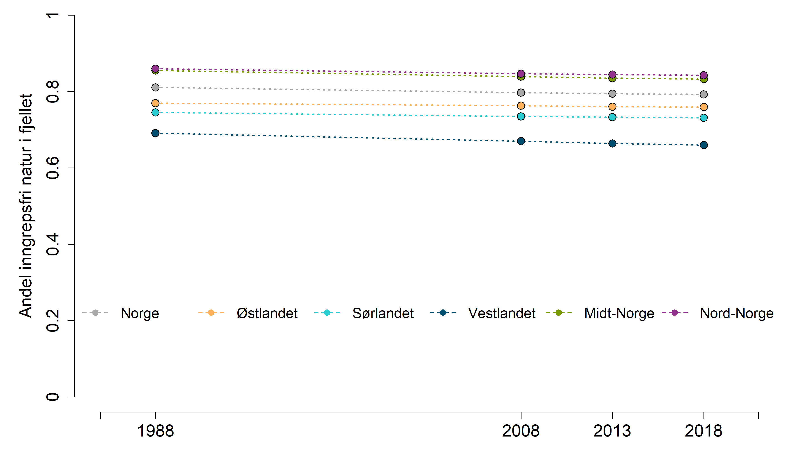

# Start

```{r setup, include=FALSE, message=FALSE}
library(knitr)
library(sf)
library(rgdal)
library(maptools)
library(tmap)
library(raster)
library(fasterize)
library(tidyverse)
library(stars)
library(DT)
knitr::opts_chunk$set(echo = TRUE)
```

Denne analysen ble først  gjort av Simon Jakobsson, 4 April 2021, i forbindelse med rapporten for skog. Det er noen ting ved den analysen som gjør at jeg har valgt å gjøre de på nytt. Det er blandt annet bedre data tilgjengelig nå. Simon har også regnet ut INON-områder per kommune. Det er en tung opperasjon som ikke er nødvendig for denne nasjonale analysen. Til slutt, det ble lagt på en tilfeldig usikkerhet på 0.05sd, noe jeg ikke syntes blir riktig. 


## Importer data

```{r, message=F}
inon2018 <- sf::st_read('P:/41201042_okologisk_tilstand_fastlandsnorge_2020_dataanaly/fjell2021/data/INON/status_2018/statusPolygon.shp')

inon2013 <- sf::st_read('P:/41201042_okologisk_tilstand_fastlandsnorge_2020_dataanaly/fjell2021/data/INON/status_2013/status_2013Polygon.shp')

inon2008 <- sf::st_read('P:/41201042_okologisk_tilstand_fastlandsnorge_2020_dataanaly/fjell2021/data/INON/status_2008/status_2008Polygon.shp')

inon1988 <- sf::st_read('P:/41201042_okologisk_tilstand_fastlandsnorge_2020_dataanaly/fjell2021/data/INON/status_1988/status_1988Polygon.shp')
```
The polygons are not complete...
```{r}
inon2018 <- st_make_valid(inon2018)
inon2008 <- st_make_valid(inon2008)
inon2013 <- st_make_valid(inon2013)
inon1988 <- st_make_valid(inon1988)
```

There are three categories. 
```{r}
table(inon2018$vsone)
```
VSONE1 is 3-5 km from infrastruktur. VSONE2 is 1-3 km away. And 'V' is >5km away. I'm not sure if the polygons overlap or not...

```{r}
nor <- readRDS('../data/norway_outline.RDS')%>%
  st_as_sf()%>%
  st_transform(crs=crs(inon2018))

```

```{r}
temp <- inon2018[inon2018$vsone=="2",]
```

```{r}
par(mfrow=c(1,2))
plot(nor$geometry, xlim=c(5000, 10000),
          ylim=c(6880000, 6885000),
     axes=T, main="all polygons")
    plot(inon2018$geometry, add=T, col = "red")
    
plot(nor$geometry, xlim=c(5000, 10000),
          ylim=c(6880000, 6885000),
     axes=T, main = "just sone 2")
    plot(temp$geometry, add=T, col = "blue")
```

The sones do not overlap so I COULD dissolve them to reduce file size (se below for how this could be done), but this operation is so heavy it's easier to just rasterize (fasterize) at this stage
```{r}
crs(inon2018)
```

```{r, eval=F}
inon2018dis <- inon2018 %>% 
  st_buffer(0.5) %>% # make a buffer of half a meter around all parts (to avoid slivers). CRS is in UTM (ie meters)
  st_union() %>% # unite to a geometry object
  st_sf() %>% # make the geometry a data frame object
  mutate(centrum = T) # return back the data value 
```

## Rasterizing
Getting the maintain raster
```{r}
fjell_low <- raster("../output/fjell_1km.tif")
fjell_low_star <- st_as_stars(fjell_low)
fjell_low_star[fjell_low_star[]==0] <- NA 
```

```{r}
hist(fjell_low_star)
```

Histogrammet viser at fjellmasken på 1km oppløsning inneholder en del celler med <100% fjell. Vi kutter ut celler mde <50% fjell

```{r}
fjell_low[fjell_low<0.5] <- 0
fjell_low[fjell_low>=0.5] <- 1
hist(fjell_low)
```


```{r}
inon2018r <- fasterize(inon2018, fjell_low)

inon2008r <- fasterize(inon2008, fjell_low)

inon2013r <- fasterize(inon2013, fjell_low)

inon1988r <- fasterize(inon1988, fjell_low)

```

```{r}
par(mfrow=c(1,2))
plot(fjell_low, main="fjellmasken")
plot(inon2018r, main="INON")

```


```{r}
summary(inon2018r)
```

Alle INON-celler er 1, alle andre er NA. Jeg må sette NA lik null.
```{r}
inon2018r[is.na(inon2018r)] <- 0
inon2013r[is.na(inon2013r)] <- 0
inon2008r[is.na(inon2008r)] <- 0
inon1988r[is.na(inon1988r)] <- 0

summary(inon2018r)
```

Så setter jeg alle celler som ikke er i fjell som NA
```{r}
inon2018r[fjell_low!=1] <- NA
inon2013r[fjell_low!=1] <- NA
inon2008r[fjell_low!=1] <- NA
inon1988r[fjell_low!=1] <- NA

summary(inon2018r)
```

```{r}
par(mfrow=c(2,2))
hist(inon1988r)
hist(inon2008r)
hist(inon2013r)
hist(inon2018r)

```

Så henter jeg inn regionene.

```{r}
reg <- st_read("P:/41201042_okologisk_tilstand_fastlandsnorge_2020_dataanaly/FINAL/Raw_data/Geografisk_oppdeling/regioner_2010/regNorway_wgs84 - MERGED.shp") %>%
  st_transform(crs=crs(inon2018))
  st_intersection(st_as_sf(nor))
 


```

```{r}
reg$INON2018 <- raster::extract(inon2018r, reg, fun = mean, na.rm=T)
reg$INON2013 <- raster::extract(inon2013r, reg, fun = mean, na.rm=T)
reg$INON2008 <- raster::extract(inon2008r, reg, fun = mean, na.rm=T)
reg$INON1988 <- raster::extract(inon1988r, reg, fun = mean, na.rm=T)

```

Fikser navn
```{r}
reg$region[reg$region=="Ã\u0098stlandet"] <- "Østlandet"
reg$region[reg$region=="Sørlandet"] <- "Sørlandet"
```


```{r}
(INON <- data.frame(reg = rep(reg$region,4),
                    year = rep(c(2018, 2013, 2008, 1988), each=5),
                    med = c(reg$INON2018, 
                            reg$INON2013,
                            reg$INON2008,
                            reg$INON1988),
                    low=NA,
                    upp=NA))
```
Legg til Norge

```{r}
norge <- aggregate(data=INON,
          med~year,
          FUN=mean)
norgetbl <- data.frame(reg = rep("Norge", nrow(norge)),
                    year = norge$year,
                    med = norge$med,
                    low=NA,
                    upp=NA)
INON <- rbind(INON, norgetbl)
```


Getting the plotting function. 'Source' doesnt work due to special characters
```{r}
eval(parse("indicator_plots.R", encoding="UTF-8"))
```


## Plotting
```{r}
png("../output/indicatorPlots/inon.png", units="in", width=12, height=7, res=300)
par(mfrow=c(1,1), mar=c(4.5,
                        5.5,
                        0,
                        2))
indicator_plot(dataset = INON,
               yAxisTitle = "Andel inngrepsfri natur i fjell",
               lowYlimit = 0,
               upperYlimit = 1,
               yStep = .2,
               minyear = 1985,
               maxyear = 2021,
               #errors = FALSE,
               legendPosition = "bottom",
               legendInset = 0.2
               )
dev.off()
```



```{r}
DT::datatable(
  INON, 
  extensions = "FixedColumns",
  options = list(
    scrollX = TRUE,
    scrollY=T,
    pageLength = 10
  ))
```


## Eksporter data for senere plotting. Det blir ingen usikkerheter eller bootstrapping i dette tilfellet
```{r, eval=F}
INONout <- select(INON, reg, year, med)


INONout$reg[INONout$reg=="Østlandet"] <- "E"
INONout$reg[INONout$reg=="Nord-Norge"] <- "N"
INONout$reg[INONout$reg=="Sørlandet"] <- "S"
INONout$reg[INONout$reg=="Midt-Norge"] <- "C"
INONout$reg[INONout$reg=="Vestlandet"] <- "W"

names(INONout)[3] <- "val"

#write.csv(INONout, "../output/indicator_values/inon.csv", row.names = F)
```

