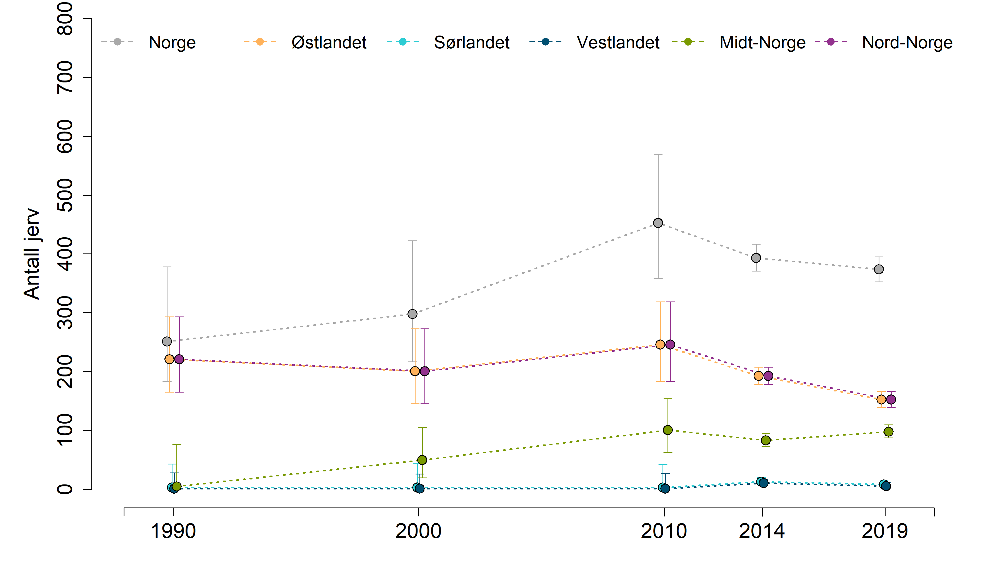
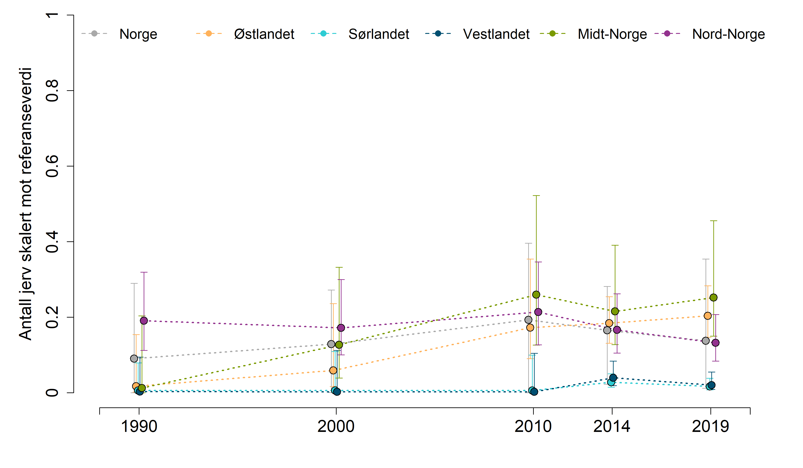

```{r setup, include=FALSE, message=FALSE}
library(knitr)
library(DT)
library(NIcalc)
library(dplyr)
library(ggplot2)
knitr::opts_chunk$set(echo = TRUE)
```


## Analyser av jervbestand
Her henter jeg data om jervbestandend i Nogre fra Naturindeksdatabsen. Tidsserien er ikke komplett og det mangler bl.a. data fra 2020 som kanskje er tilgjengelig i rovbase. Men vi det har ikke skjedd noe dramatisk med polpulasjonen siden siset NI-vurdering.

# Import - Importerer data fra NI
Fyll inn ditt eget passord og brukernavn
```{r}
myUser <- "anders.kolstad@nina.no"
myPwd  <- "" # hemmelig passord
```

Importerer data fra NI-databasen og lagrer datasettet på server
```{r import, eval=F}

jerv <- NIcalc::importDatasetApi(
  username = myUser,
  password = myPwd,
  eco = "Fjell", 
  indic = "Jerv",
  year = c(1990,2000,2010,2014,2019))
saveRDS(jerv, "../data/jervNIexport.rds")

```


```{r}
jerv <- readRDS("../data/jervNIexport.rds")
```


# Assemble - Strukturerer datasettet

Spesifiser hele landarealet til Norge, samt de tre regionene, som NIunits:
```{r}
myNIunits <- c(allArea = T, parts = T, counties = F)
```

Inkludrer alle BSunits (kommuner):
```{r}
myPartOfTotal <- 0
```


Siden denne opperasjonen tar litt tid så lagrer jeg outputen på server og henter det tilbake etterpå, så slipper jeg å kjøre gjennom hver gang.
```{r, eval=FALSE}
jerv_assemeble <- NIcalc::assembleNiObject(
  inputData = jerv,
  predefNIunits = myNIunits, 
  partOfTotal = myPartOfTotal, 
  indexType = "thematic",
  part = "ecosystem",
  total = "terrestrial")  
saveRDS(jerv_assemeble, "../data/jerv_assemble.rds")

```

```{r}
jerv_assemeble <- readRDS("../data/jerv_assemble.rds")
```


Indikatorveriene kommer både som tall og i form av sannsynlighetsfunskjoner. 
Her simulerer jeg indikatorverdier 1000 ganger per år.
```{r}
# bruker tradOb siden custumDist er NA. Dette er ikke en generisk løsning.
obstype <- rep("tradObs", nrow(jerv_assemeble$indicatorValues$'2019'))

myYears <- as.character(c(1990,2000,2010,2014,2019))
for(i in 1:length(myYears)){
# print(i)


  myMat <- NIcalc::sampleObsMat(
          jerv_assemeble$indicatorValues[[i]]$ICunitId, 
          jerv_assemeble$indicatorValues[[i]]$expectedValue,
          jerv_assemeble$indicatorValues[[i]]$distributionFamilyName,
          mu = jerv_assemeble$indicatorValues[[i]]$distParameter1,
          sig = jerv_assemeble$indicatorValues[[i]]$distParameter2,
          customDistribution = jerv_assemeble$indicatorValues[[i]]$customDistribution,
          obsType = obstype,
          nsim = 1000
          
)
assign(paste0("myMat", myYears[i]), myMat)
}


```

Her er anslått antall jerv i 2019:
```{r}
median(colSums(myMat2019))
```

Dette ligner å de tallene som allerede finnes i tabellen:
```{r}
sum(jerv_assemeble$indicatorValues$'2019'$expectedValue)
```

men nå har vi også fordelingen, dvs usikkerheten:
```{r}
quantile(colSums(myMat2019), c(0.025, .5, .975))

```

## Fordeling av refverdier

I dette tilfelle har referanseverdiene også en usikkerhet. Vi kan regnet ut fordelingen på samme måte som over - ta colsums - og dele mu med ref  for å få fordelingen av de skalerte indikatorverdiene. Husk å trunkere alle verdier over 1. Refverdiene er like for alle år.

```{r}
myMatr <- NIcalc::sampleObsMat(
            jerv_assemeble$referenceValues$ICunitId, 
            jerv_assemeble$referenceValues$expectedValue,
            jerv_assemeble$referenceValues$distributionFamilyName,
            mu = jerv_assemeble$referenceValues$distParameter1,
            sig = jerv_assemeble$referenceValues$distParameter2,
            customDistribution = jerv_assemeble$referenceValues$customDistribution,
            obsType = obstype,
            nsim =1000
        )

jerv2019scaled <- colSums(myMat2019)/colSums(myMatr)
hist(jerv2019scaled)
```

Her er det ingen grunn til å trunkere verdier over 1.

Denne fordelingen har vi summert indikatorverdiene og referanseverdiene for alle åtte regionene. Dette blir litt feil. Vi ønsker at den nasjonele indikatorverdien skal være gjennomsnittet av de skalerte indikatorverdien i regionene. Jeg tror ikke vi skal veie regionene ut ifra fjellareal i dette tilfelle. 

Jeg gjør det først slik at den nasjoneale verdien er summen av tilstandsverdeien og referanseverdiene i regionene. Deretter gjør jeg det på den andre måten, den den nasjonale verdiener gjennomsnittet av de skalerte regionale verdiene. Deretter sammenligner jeg de to svarene. 

## Skalering
Her slår jeg sammen de relevante rovviltregionene til ØT regioner. Jeg inkluderer alle rovviltregioner som overlapper med den respektive ØTregionen. Her er det et forbedringspotensial ved å veie dataene fra de ulike rovviltregionene ulikt ettersom hvro stor overlapp de har med ØT-regionene.

```{r}
table(jerv_assemeble$referenceValues$ICunitName,
      jerv_assemeble$referenceValues$ICunitId)
```

```{r}
nord <- c(1302, 1304)
midt <- 1305
vest <- 1311
sør <- c(1311,1313)
øst <- c(1313, 1315, 5141, 1316)
```


```{r}
regions <- c("Norge", "N", "C", "W", "S", "E")

jervTbl <- data.frame(
  reg = rep(regions, each=length(myYears)),
  year = rep(myYears, length(regions)),
  low = NA,
  med = NA,
  upp = NA
)

jervTbl_unscaled <- data.frame(
  reg = rep(regions, each=length(myYears)),
  year = rep(myYears, length(regions)),
  low = NA,
  med = NA,
  upp = NA
)

for(i in regions){
  
   for(n in myYears){
     
     tempMat <- get(paste0("myMat", n))
     tempMat <- as.data.frame(tempMat)
     myMatrX <- as.data.frame(myMatr)
     
     if(i == "N") tempMat <- tempMat[row.names(tempMat) %in% nord,] 
     if(i == "C") tempMat <- tempMat[row.names(tempMat) %in% midt,] 
     if(i == "W") tempMat <- tempMat[row.names(tempMat) %in% vest,] 
     if(i == "S") tempMat <- tempMat[row.names(tempMat) %in% sør,] 
     if(i == "E") tempMat <- tempMat[row.names(tempMat) %in% nord,] 
     
     if(i == "N") myMatrX <- myMatrX[row.names(myMatrX) %in% nord,] 
     if(i == "C") myMatrX <- myMatrX[row.names(myMatrX) %in% midt,] 
     if(i == "W") myMatrX <- myMatrX[row.names(myMatrX) %in% vest,] 
     if(i == "S") myMatrX <- myMatrX[row.names(myMatrX) %in% sør,] 
     if(i == "E") myMatrX <- myMatrX[row.names(myMatrX) %in% nord,] 

     
     tempMatScaled <- colSums(tempMat)/colSums(myMatrX)
     
     jervTbl[jervTbl$reg==i & jervTbl$year==n, 3:5] <- quantile(tempMatScaled, c(0.025, .5, .975))
     jervTbl_unscaled[jervTbl_unscaled$reg==i & jervTbl$year==n, 3:5] <- 
       quantile(colSums(tempMat), c(0.025, .5, .975))

     
 }
    
}
  


```


Så gjør jeg det samme, bare at den nasjonale verdien lages ved å bootstrappe de regionale verdiene. 
```{r}
regions <- c("N", "C", "W", "S", "E")

jervTbl2 <- data.frame(
  reg = rep(regions, each=length(myYears)*1000),
  year = rep(myYears, each = 1000, times=length(regions)),
  val = NA
)

#table(jervTbl2$reg, jervTbl2$year)

# The table with nasjonal values should be 
# 5 regions X 200 samples X 5 years = 5000

jervNorge <- data.frame(
  reg = rep("Norge", 5000),
  sampleReg = rep(regions, each=1000),
  year = rep(myYears, each = 200, times=length(regions)),
  val = NA
)
#table(jervNorge$sampleReg, jervNorge$year)
jervNorge2 <- jervNorge

for(i in regions){
  
   for(n in myYears){
     
     # Get the right year
     tempMat <- get(paste0("myMat", n))
     tempMat <- as.data.frame(tempMat)
     myMatrX <- as.data.frame(myMatr)
     jervNorgeX <- jervNorge2[jervNorge2$year == n &
                                jervNorge2$sampleReg == i,]

     # geth the right rows (regions)
     if(i == "N") tempMat <- tempMat[row.names(tempMat) %in% nord,] 
     if(i == "C") tempMat <- tempMat[row.names(tempMat) %in% midt,] 
     if(i == "W") tempMat <- tempMat[row.names(tempMat) %in% vest,] 
     if(i == "S") tempMat <- tempMat[row.names(tempMat) %in% sør,] 
     if(i == "E") tempMat <- tempMat[row.names(tempMat) %in% nord,] 
     
     if(i == "N") myMatrX <- myMatrX[row.names(myMatrX) %in% nord,] 
     if(i == "C") myMatrX <- myMatrX[row.names(myMatrX) %in% midt,] 
     if(i == "W") myMatrX <- myMatrX[row.names(myMatrX) %in% vest,] 
     if(i == "S") myMatrX <- myMatrX[row.names(myMatrX) %in% sør,] 
     if(i == "E") myMatrX <- myMatrX[row.names(myMatrX) %in% nord,] 

     # Scale
     tempMatScaled <- colSums(tempMat)/colSums(myMatrX)
     
     # add 1000 observations to the dataframe
     jervTbl2[jervTbl2$reg==i & jervTbl2$year==n, "val"] <- tempMatScaled
     
     # sample 200 scale values for each region and year combo 
     # and add to a seperate dataframe
     jervNorgeX$val <- sample(tempMatScaled, size=200, replace=T)
     
     ifelse(is.na(jervNorge$val[1]), 
            jervNorge <- jervNorgeX,
            jervNorge <- rbind(jervNorge, jervNorgeX))
 }
    
}
  
```

The table with regional values should be 5 regions X 5 years X 1000 samples = 25 000
```{r}
dim(jervTbl2)
```

```{r}
dim(jervNorge)
```
Bind together
```{r}
jervTbl2 <- rbind(jervTbl2, select(jervNorge, -sampleReg))
```

Compare the two methods
```{r}
sumMethod <- jervTbl[jervTbl$reg=="Norge",c("year", "med")]
sumMethod$method <- "sum method"
sumMethod
```
```{r}
meanMethod <- aggregate(data=jervTbl2[jervTbl2$reg=="Norge",],
          val~year,
          FUN= mean)
meanMethod$method <- "mean method"
meanMethod          
```

```{r}
names(sumMethod) <- names(meanMethod)
comp <- rbind(sumMethod, meanMethod)
ggplot(data=comp)+
  geom_line(aes(x=year, y=val, linetype=method, group = method))+
  geom_point(aes(x=year, y=val))
```

Metoden vi bruker (mean metoden) gir litt lavere skår.

```{r}
#source("indicator_plots2.R")
eval(parse("indicator_plots.R", encoding="UTF-8"))

eval(parse("indicator_plots2.R", encoding="UTF-8"))


```


```{r, eval=F, include=FALSE}
png("../output/indicatorPlots/jerv.png", units="in", width=12, height=7, res=300)

# Plot windows par
par(mfrow=c(1,1), mar=c(4.5,
                        5.5,
                        0,
                        2))


indicator_plot2(dataset = jervTbl2,
               yAxisTitle = "Antall jerv skalert mot referanseverdi",
               lowYlimit = 0,
               upperYlimit = 1,
               yStep = .2,
               minyear = 1988,
               maxyear = 2021,
               colours = c("#FFB25B", "#2DCCD3", "#004F71", "#7A9A01", "#93328E", "dark grey"),
               legendPosition = "top",
               legendInset = 0,
               move = 0.1,
               horizontal = T,
               legendTextSize = 1.25)
dev.off()


png("../output/indicatorPlots/jerv_uskalert.png", units="in", width=12, height=7, res=300)

# Plot windows par
par(mfrow=c(1,1), mar=c(4.5,
                        5.5,
                        0,
                        2))


indicator_plot(dataset = jervTbl_unscaled,
               yAxisTitle = "Antall jerv",
               lowYlimit = 0,
               upperYlimit = 800,
               yStep = 100,
               minyear = 1988,
               maxyear = 2021,
               colours = c("#FFB25B", "#2DCCD3", "#004F71", "#7A9A01", "#93328E", "dark grey"),
               legendPosition = "top",
               legendInset = 0,
               move = 0.1,
               horizontal = T,
               legendTextSize = 1.25)
dev.off()

```


# Oppsummering






Under er tabellen med skalerte verdier for hvert år og region (med = median, og det er det som er 'tilstanden')

```{r}

finalTbl <- aggregate(data=jervTbl2,
          val~year+reg,
          FUN= function(x) round(
            quantile(x, c(.025, .5, .975)), 2))

finalTbl <- do.call(data.frame, finalTbl)
names(finalTbl) <- c("year", "reg", "low", "med", "upp")

DT::datatable(
  finalTbl, 
  extensions = "FixedColumns",
  options = list(
    scrollX = TRUE,
    scrollY=T,
    pageLength = 10
  ))
```

# Eksporter csv

```{r, eval=F}
write.csv(jervTbl2, "../output/indicator_values/jerv.csv", row.names = F)
```

