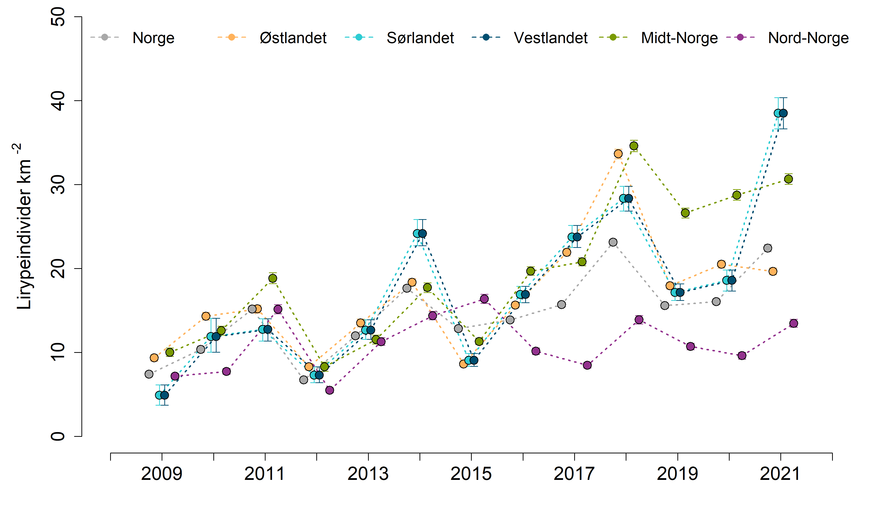

# Start
```{r setup, include=FALSE, message=FALSE}
library(knitr)
library(DT)
library(dplyr)
library(matrixStats)
library(ggplot2)
library(readxl)
library(data.table)
library(readxl)
knitr::opts_chunk$set(echo = TRUE)
```

```{r}
dat <- load("../data/lirype_jags_old.RData")
```

```{r}
Five_years_mean <- as.data.frame(Five_years_mean)
names(Five_years_mean) <- c("Nord-Norge", "Midt-Norge", "Østlandet", "Sørvest-Norge")
head(Five_years_mean)
```
Summert for hele Norge

Fjellareal per region:
```{r}
wgt <- readRDS("../data/fjellareal.rds")
wgt$Fjellareal2 <- wgt$Fjellareal/max(wgt$Fjellareal)
wgt$reg <- c("N", "C", "E", "W", "S")
```

Vekter
```{r}
(myWgt <- c(wgt$Fjellareal2[1:3], mean(wgt$Fjellareal2[4:5])))
```

```{r}
Five_years_mean2 <- as.matrix(Five_years_mean)
Five_years_mean$Norge <- matrixStats::rowWeightedMeans(Five_years_mean2, myWgt)

Five_years_mean$`Nord-Norge_S` <- Five_years_mean$`Nord-Norge`/36
Five_years_mean$`Midt-Norge_S` <- Five_years_mean$`Midt-Norge`/36
Five_years_mean$`Sørvest-Norge_S` <- Five_years_mean$`Sørvest-Norge`/36
Five_years_mean$Østlandet_S <- Five_years_mean$Østlandet/36


```

```{r, warning=F}
dat <- data.table::melt(data = Five_years_mean,
                        measure.vars=names(Five_years_mean),
                        variable.name="reg",
                        value.name="val")
```


# Hele Norge

```{r, eval=F}
norge_s <- NULL
for(i in 1:10000){
  temp <- c(
      sample(dat$val[dat$reg == "Nord-Norge_S"],   1),
      sample(dat$val[dat$reg == "Midt-Norge_S"],   1),
      sample(dat$val[dat$reg == "Østlandet_S"],    1),
      sample(dat$val[dat$reg == "Sørvest-Norge_S"],1),
      sample(dat$val[dat$reg == "Sørvest-Norge_S"],1)
    )
  norge_s <- c(norge_s, weighted.mean(temp, wgt$Fjellareal2))
}
```

Hurtigløsning. Alle datasett og figurer er laget med 10000 sim.
```{r}
norge_s <- NULL
for(i in 1:100){
  temp <- c(
      sample(dat$val[dat$reg == "Nord-Norge_S"],   1),
      sample(dat$val[dat$reg == "Midt-Norge_S"],   1),
      sample(dat$val[dat$reg == "Østlandet_S"],    1),
      sample(dat$val[dat$reg == "Sørvest-Norge_S"],1),
      sample(dat$val[dat$reg == "Sørvest-Norge_S"],1)
    )
  norge_s <- c(norge_s, weighted.mean(temp, wgt$Fjellareal2))
}
```

```{r}
norge <- data.frame(reg = "Norge_s",
                    val = norge_s)
dat <- rbind(dat, norge)
table(dat$reg)
```


```{r}
dat2 <- aggregate(data = dat,
                  val~reg, FUN = mean)

#dat2$sd <- aggregate(data = dat,
#                  val~reg, FUN = sd)[,2]

temp <- aggregate(data = dat,
                  val~reg,
                  FUN = function(x) c(quantile(x, c(0.025, 0.5, 0.975))))
temp <- do.call(data.frame, temp)

dat2 <- cbind(dat2, temp[,-1])
```

Subset
```{r}
temp1 <- c("Nord-Norge", "Midt-Norge", "Østlandet", "Sørvest-Norge", "Norge")
temp2 <- c("Nord-Norge_S", "Midt-Norge_S", "Østlandet_S", "Sørvest-Norge_S", "Norge_s")
std <- dat2[dat2$reg %in% temp2,]
raw <- dat2[dat2$reg %in% temp1,]
```


```{r}
(ggrype <- ggplot(data = raw, aes(x = factor(reg, levels = temp1), y = val))+
  geom_bar(stat="identity", colour="black", size=1.2,
           fill="grey80")+
  geom_errorbar(aes(ymax = val.2.5., ymin = val.97.5.),
                width=0, size=2)+
  #geom_violin(data = dat, aes(x = reg, y = val),
  #            fill="black", trim=F, scale="width",
  #         fill="grey80")+
  theme_bw(base_size = 20)+
  ylab(expression(paste("Lirypeindivider km "^"-2")))+
  xlab("")+
  geom_hline(yintercept = 36, size=1.2, linetype="dashed")+
  theme(
    axis.text.x = element_text(angle = 90, vjust = 0.5, hjust=1)
  )+
  ylim(c(0,40)))
```

```{r, eval=F}
png("../output/indicatorPlots/uskalert/lirype_barplot.png", 
    units="in", width=6, height=8, res=300)
ggrype
dev.off()
```


```{r}
(ggrype2 <- ggplot(data = std, aes(x = factor(reg, levels = temp2), y = val))+
  geom_bar(stat="identity", colour="black", size=1.2,
           fill="grey80")+
   geom_errorbar(aes(ymax = val.2.5., ymin = val.97.5.),
                width=0, size=2)+
  #geom_violin(data = dat, aes(x = reg, y = scal),
  #            fill="black", trim=F, scale="width",
  #         fill="grey80")+
  theme_bw(base_size = 20)+
  ylab("Lirypetetthet skalert\nmot referansetilstand")+
  xlab("")+
  theme(
    axis.text.x = element_text(angle = 90, vjust = 0.5, hjust=1)
  )+
   ylim(c(0,1))+
   scale_x_discrete(breaks = temp2,
                    labels = temp1)
)
```

```{r, eval=F}
png("../output/indicatorPlots/skalert/lirype.png", 
    units="in", width=6, height=8, res=300)
ggrype2
dev.off()
```

# Eksport
```{r, eval=F}

datExp <- dat[dat$reg %in% temp2,]
datExp$reg <- droplevels(datExp$reg)
datExp$reg <- plyr::revalue(datExp$reg,
                            c(
                              "Nord-Norge_S" = "N",
                              "Midt-Norge_S" = "C",
                              "Sørvest-Norge_S" = "S",
                              "Østlandet_S" = "E",
                              "Norge_s" = "Norge"
                            ))

west <- datExp[datExp$reg=="S",]
west$reg <- "W"
datExp <- rbind(datExp, west)
write.csv(datExp, "../output/indicator_values/lirype.csv", row.names = F)
```

# Tidsserie
```{r}
rm(list = ls())
```


```{r}
ser <- load("../data/lirype_jags.RData")
ser <- Mean_density_region_year
dim(ser)
```
Det er iterasjon X region x år.


Her er matrisen for region 1 med 13 år 2009-2021
```{r}
dim(ser[,1,])
```
Rekkefølgen på regionene er slik
```{r}
order <- c("Nord-Norge", "Midt-Norge", "Østlandet", "Sørvest-Norge")
order2 <- c("N", "C", "E", "S")

```


```{r, warning=F}
temp <- NULL
df <- NULL
for(i in 1:length(order2)){
  temp <- as.data.frame(ser[,i,])
  
  colnames(temp) <- 2009:2021
  temp <- temp[1:1000,]
  
  temp <- data.table::melt(data = temp,
                            variable.name = "year",
                            value.name="val")
  temp$reg <- order2[i]
  df <- rbind(df, temp)
}
```

```{r}
unique(df$reg)
```

Kloner S og W
```{r}
W <- df[df$reg=="S",]
W$reg <- "W"
df <- rbind(df, W)
table(df$reg, df$year)
```


# Veiing
Regner ut nasjonale indikatorverdier som et veid (etter total fjelareal) gjennomsnitt av vedien i regionene. Veiingen gjøres ved å samle større antall verdier for de regionene som har mest fjell i seg.
```{r}
wgt <- readRDS("../data/fjellareal.rds")
wgt$Fjellareal2 <- wgt$Fjellareal/max(wgt$Fjellareal)
wgt$reg <- c("N", "C", "E", "W", "S")
wgt
```


```{r}
regions <- c("N", "C", "E", "W", "S")
myYears <- 2009:2021

nor <- data.frame(
 
  year = rep(myYears, each = 1000),
  val = as.numeric(NA),
   reg = rep("Norge", 1000*length(myYears))
)

table(nor$year)

for(n in myYears){
  
  temp <- df[df$year == n,]
  temp3 <- NULL
    for(i in 1:1000){
    
      temp2 <- c(
      sample(temp$val[temp$reg == "N"], 1),
      sample(temp$val[temp$reg == "C"], 1),
      sample(temp$val[temp$reg == "E"], 1),
      sample(temp$val[temp$reg == "W"], 1),
      sample(temp$val[temp$reg == "S"], 1)
    )
      temp3  <- c(temp3, weighted.mean(temp2, wgt$Fjellareal2))
    }
   nor$val[nor$year==n] <- temp3
}

```
```{r}
df <- rbind(df, nor)
df$year <- as.numeric(as.character(df$year))
```


```{r}
eval(parse("indicator_plots2.R", encoding="UTF-8"))

```

```{r, eval=F}
png("../output/indicatorPlots/uskalert/lirype.png", 
    units="in", width=12, height=7, res=300)

# Plot windows par
par(mfrow=c(1,1), mar=c(4.5,
                        5.5,
                        0,
                        2))


indicator_plot2(dataset = df,
               yAxisTitle = expression(paste("Lirypeindivider km "^"-2")),
               lowYlimit = 0,
               upperYlimit = 50,
               yStep = 10,
               minyear = 2008,
               maxyear = 2022,
               colours = c("#FFB25B", "#2DCCD3", "#004F71", "#7A9A01", "#93328E", "dark grey"),
               legendPosition = "top",
               legendInset = 0,
               move = 0.1,
               horizontal = T,
               legendTextSize = 1.25)
dev.off()


```

