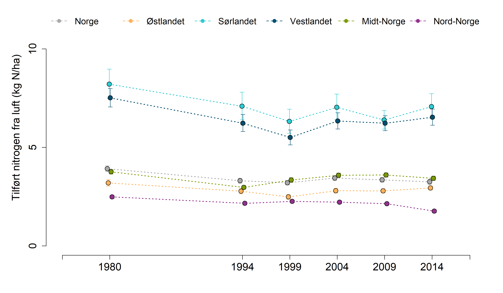

```{r setup, include=FALSE, message=FALSE}
library(knitr)
library(dplyr)
knitr::opts_chunk$set(echo = TRUE)
```

Disse analysene ble gjort av Simon Jakobsson i forbindelse med skograpporten. Her tar jeg bare inn data igjen for å plotte de.
Se: P:/41201042_okologisk_tilstand_fastlandsnorge_2020_dataanaly/FINAL/Scripts/Indicators/nitrogen.R




```{r}
### Nitrogen data (old method, same for all years; for trend figure)
nitrogen <- read.csv("P:/41201042_okologisk_tilstand_fastlandsnorge_2020_dataanaly/FINAL/Indicator_values/Alpine/nitrogen_fjell_OLDMETHOD.csv", header=T) # w. 2014 based on old method

nitrogen <- nitrogen %>% dplyr::select(reg, year, val_unscaled) %>%
  dplyr::rename(val=val_unscaled)
```

```{r}
eval(parse("indicator_plots2.R", encoding="UTF-8"))

```


```{r, eval=F}
png("../output/supplerende indikatorer/nitrogen.png", 
    units="in", width=12, height=7, res=300)

par(mfrow=c(1,1), mar=c(4.5,
                        5.5,
                        0,
                        2))

indicator_plot2(dataset = nitrogen,
               yAxisTitle = "Tilført nitrogen fra luft (kg N/ha)",
               lowYlimit = 0,
               upperYlimit = 12,
               yStep = 5,
               minyear = 1975,
               maxyear = 2018,
               colours = c("#FFB25B", "#2DCCD3", "#004F71", "#7A9A01", "#93328E", "dark grey"),
               legendPosition = "top",
               legendInset = 0,
               move = 0.1,
               horizontal = T,
               legendTextSize = 1.25)
dev.off()
```


