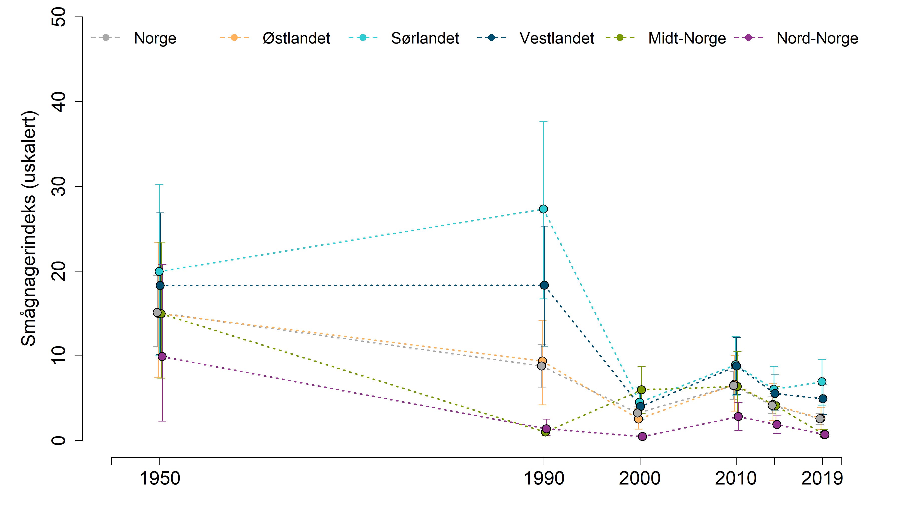
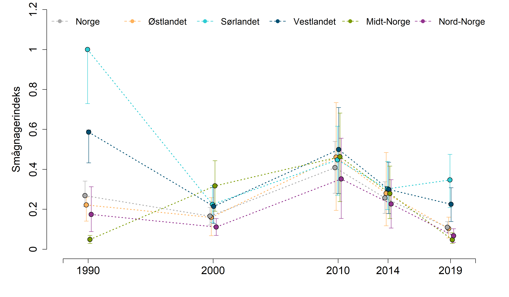

```{r setup, include=FALSE, message=FALSE}
library(knitr)
library(DT)
library(NIcalc)
library(dplyr)
library(ggplot2)
knitr::opts_chunk$set(echo = TRUE)
```

# Import
Henter data fra NI-databasen. Måleenheten er snitt bestandstopper pr 10år, som fangst pr 100 felledøgn.

Fyll inn ditt eget passord og brukernavn
```{r}
myUser <- "anders.kolstad@nina.no"
myPwd  <- "" # hemmelig passord
```


Importerer data fra NI-databasen og lagrer datasettet på server
```{r import, eval=F}

dat <- NIcalc::importDatasetApi(
  username = myUser,
  password = myPwd,
  eco = "Fjell", 
  indic = "smågnagere - fjellbestander",
  year = c(1950, 1990,2000,2010,2014,2019))
saveRDS(dat, "../data/smågnagereNIexport.rds")

```


```{r}
dat <- readRDS("../data/smågnagereNIexport.rds")
```

Spesifiser hele landarealet til Norge, samt de tre regionene, som NIunits:
```{r}
myNIunits <- c(allArea = T, parts = T, counties = F)
```

Inkludrer alle BSunits (kommuner):
```{r}
myPartOfTotal <- 0
```


Siden denne opperasjonen tar litt tid så lagrer jeg outputen på server og henter det tilbake etterpå, så slipper jeg å kjøre gjennom hver gang.
```{r, eval=FALSE}
dat_assemeble <- NIcalc::assembleNiObject(
  inputData = dat,
  predefNIunits = myNIunits, 
  partOfTotal = myPartOfTotal, 
  indexType = "thematic",
  part = "ecosystem",
  total = "terrestrial")  
saveRDS(dat_assemeble, "../data/smågnagere_assemble.rds")

```

```{r}
dat_assemeble <- readRDS("../data/smågnagere_assemble.rds")
```


Trekker ut indikatorverdier og referanseverdier fra sannynslighetsfordelingen.
```{r}
myYears <- as.character(c(1950, 1990,2000,2010,2014,2019))
obstype <- NULL

for(i in 1:length(myYears)){
  
  obs <- dat_assemeble$indicatorValues[[i]]$distributionFamilyName
  
  obs[!is.na(obs)] <- "tradObs"
  obs[is.na(obs)]  <- "customObs"
  
  obstype[[i]] <- obs
  }
```

```{r}
for(i in 1:length(myYears)){
# print(i)
  myMat <- NIcalc::sampleObsMat(
   ICunitId           = dat_assemeble$indicatorValues[[i]]$ICunitId, 
   value              = dat_assemeble$indicatorValues[[i]]$expectedValue,
   distrib            = dat_assemeble$indicatorValues[[i]]$distributionFamilyName,
   mu                 = dat_assemeble$indicatorValues[[i]]$distParameter1,
   sig                = dat_assemeble$indicatorValues[[i]]$distParameter2,
   customDistribution = dat_assemeble$indicatorValues[[i]]$customDistribution,
   obsType            = obstype[[i]],
   nsim               = 10000
          
)
assign(paste0("myMat", myYears[i]), myMat)
}

```

Radene i denne matrisen er ICunitIDs som ser ut som fylker i dette tilfelle, MEN det er ikke det. NI-databasen viser at det er andre inndelinger som har blitt gitt navn som ligner på fylket som er mest dominerende. Dette gjør det veldig vanskelig å jobbe med etter samme metode som fjellrev og jerv. Om jeg bare tar gjennomsnittet av de regionene som overlapper med mine ØT-regioner så blir usikkerheten veldig stor. Det kan være bedre å skalere mot referanseverdien først, altså å følge NI-metoden. NI-metoden tror jeg også knytter de skaerte indikatorverdiene til BSuints slik at man ikke får dette problemet med overlappende regioner. 

Jeg gjør et forsøk alikevel. Jeg må gjøre det slik om jeg ønsker uskalerte verdier uansett.
```{r}
table(dat_assemeble$referenceValues$ICunitName,
      dat_assemeble$referenceValues$ICunitId)

```
5460 er Buskerud og Telemark, dvs både Sør- og Østlandet. 
5461 er Agder og Rogaland, dvs både Sør- og Vestlandet.
5463 er Sogn og Fjordane og Møre (bare Vestlandet)
Både Hedmark og Oppland (-58 og -59) har noe av Trøndelag i seg, men jeg ignorer dette.
```{r}
nord <- c(5467, 5468)
midt <- c(5465, 5466)
vest <- c(5461, 5462,5463)
sør  <- c(5460, 5461)
øst  <- c(5458, 5459,5460) 
```


# Referanseverdier
Referanseverdiene er de samme for hvert år og ingen har custumDistribution
```{r}
obstype <- rep("tradObs", nrow(dat_assemeble$referenceValues))

myMatr <- NIcalc::sampleObsMat(
  ICunitId           = dat_assemeble$referenceValues$ICunitId, 
  value              = dat_assemeble$referenceValues$expectedValue,
  distrib            = dat_assemeble$referenceValues$distributionFamilyName,
  mu                 = dat_assemeble$referenceValues$distParameter1,
  sig                = dat_assemeble$referenceValues$distParameter2,
  customDistribution = dat_assemeble$referenceValues$customDistribution,
  obsType            = obstype,
  nsim =10000
        )
```

Siden variabelen er en tetthet (antall dyr fanger per felledøgn) så passer det bedre å ta gjennomsnitt istedet for sum slik vi har gjort for jerv og fjellrev for eksempel.
```{r}

hist(colMeans(myMatr), col="red", xlim=c(0,25), main = "Forventningsverdier i rødt\nFaktiske verdier i blått")
hist(colMeans(myMat2019), col="blue", xlim=c(0,25), add=T)
```

Det ser ut til at det går dårlig med smågnagerne i fjellet... :(

Referanseverdiene varierer noe rundt om i landet.
```{r}
barplot(rowMeans(myMatr))
```


# Utregninger
Først regner jeg ut uskalerte verdier for regionene

```{r}
regions <- c("Norge", "N", "C", "W", "S", "E")

Tbl_unscaled <- data.frame(
  reg = rep(regions, each=length(myYears)),
  year = rep(myYears, length(regions)),
  low = NA,
  med = NA,
  upp = NA
)

for(i in regions){
  
   for(n in myYears){
     
     tempMat <- get(paste0("myMat", n))
     tempMat <- as.data.frame(tempMat)
     myMatrX <- as.data.frame(myMatr)
     
     if(i == "N") tempMat <- tempMat[row.names(tempMat) %in% nord,] 
     if(i == "C") tempMat <- tempMat[row.names(tempMat) %in% midt,] 
     if(i == "W") tempMat <- tempMat[row.names(tempMat) %in% vest,] 
     if(i == "S") tempMat <- tempMat[row.names(tempMat) %in% sør,] 
     if(i == "E") tempMat <- tempMat[row.names(tempMat) %in% øst,] 
     
     if(i == "N") myMatrX <- myMatrX[row.names(myMatrX) %in% nord,] 
     if(i == "C") myMatrX <- myMatrX[row.names(myMatrX) %in% midt,] 
     if(i == "W") myMatrX <- myMatrX[row.names(myMatrX) %in% vest,] 
     if(i == "S") myMatrX <- myMatrX[row.names(myMatrX) %in% sør,] 
     if(i == "E") myMatrX <- myMatrX[row.names(myMatrX) %in% øst,] 
     
     Tbl_unscaled[Tbl_unscaled$reg==i & Tbl_unscaled$year==n, 3:5] <- 
       quantile(colMeans(tempMat), c(0.025, .5, .975))

     
 }
    
}
  
```

```{r}
eval(parse("indicator_plots.R", encoding="UTF-8"))
eval(parse("indicator_plots2.R", encoding="UTF-8"))
```

# Plotter uskalerte verdier

```{r, message=F}
png("../output/indicatorPlots/smågnagere_uskalert.png", 
    units="in", width=12, height=7, res=300)

par(mfrow=c(1,1), mar=c(4.5,
                        5.5,
                        0,
                        2))

indicator_plot(dataset = Tbl_unscaled,
               yAxisTitle = "Smågnagerindeks (uskalert)",
               lowYlimit = 0,
               upperYlimit = 50,
               yStep = 10,
               minyear = 1945,
               maxyear = 2021,
               colours = c("#FFB25B", "#2DCCD3", "#004F71", "#7A9A01", "#93328E", "dark grey"),
               legendPosition = "top",
               legendInset = 0,
               move = 0.1,
               horizontal = T,
               legendTextSize = 1.25)
dev.off()
```

# Skalerte verdier
Nå regner jeg ut skalerte indikatorverdier.

```{r}
regions <- c("N", "C", "W", "S", "E")

Tbl2 <- data.frame(
  reg = rep(regions, each=length(myYears)*10000),
  year = rep(myYears, each = 10000, times=length(regions)),
  val = NA
)


for(i in regions){
  
   for(n in myYears){
     
     # Get the right year
     tempMat <- get(paste0("myMat", n))
     tempMat <- as.data.frame(tempMat)
     myMatrX <- as.data.frame(myMatr)
    

     # get the right rows (regions)
     if(i == "N") tempMat <- tempMat[row.names(tempMat) %in% nord,] 
     if(i == "C") tempMat <- tempMat[row.names(tempMat) %in% midt,] 
     if(i == "W") tempMat <- tempMat[row.names(tempMat) %in% vest,] 
     if(i == "S") tempMat <- tempMat[row.names(tempMat) %in% sør,] 
     if(i == "E") tempMat <- tempMat[row.names(tempMat) %in% øst,] 
     
     if(i == "N") myMatrX <- myMatrX[row.names(myMatrX) %in% nord,] 
     if(i == "C") myMatrX <- myMatrX[row.names(myMatrX) %in% midt,] 
     if(i == "W") myMatrX <- myMatrX[row.names(myMatrX) %in% vest,] 
     if(i == "S") myMatrX <- myMatrX[row.names(myMatrX) %in% sør,] 
     if(i == "E") myMatrX <- myMatrX[row.names(myMatrX) %in% øst,] 

     # Scale
     tempMatScaled <- colMeans(tempMat)/colMeans(myMatrX)
     
     # add 1000 observations to the dataframe
     Tbl2[Tbl2$reg==i & Tbl2$year==n, "val"] <- tempMatScaled
     
     
 }
    
}
  
```

# Veiing
Regner ut nasjonale indikatorverider som et veid (etter total fjelareal) gjennomsnitt av vedien i regionene. Veiingen gjøres ved å samle større antall verdier for de regionene som har mest fjell i seg.
```{r}
wgt <- readRDS("../data/fjellareal.rds")
wgt$Fjellareal2 <- wgt$Fjellareal/max(wgt$Fjellareal)
wgt$reg <- c("N", "C", "E", "W", "S")
```

```{r}
datNorge <- data.frame(
  reg = rep("Norge", 30000),
  year = rep(myYears, each = 1000, times=length(regions)),
  val = NA
)

for(n in myYears){
    temp <- Tbl2[Tbl2$year == n,]
    
    temp2 <- c(
      sample(temp$val[temp$reg == "N"], wgt$Fjellareal2[wgt$reg == "N"]*10000, replace =T),
      sample(temp$val[temp$reg == "E"], wgt$Fjellareal2[wgt$reg == "E"]*10000, replace =T),
      sample(temp$val[temp$reg == "W"], wgt$Fjellareal2[wgt$reg == "W"]*10000, replace =T),
      sample(temp$val[temp$reg == "S"], wgt$Fjellareal2[wgt$reg == "S"]*10000, replace =T),
      sample(temp$val[temp$reg == "C"], wgt$Fjellareal2[wgt$reg == "C"]*10000, replace =T)
    )
    
    datNorge$val[datNorge$year == n] <- sample(temp2, 10000, replace = T)
}
```

```{r}
Tbl2 <- rbind(Tbl2, datNorge)
```

Trunkerer verdier over 1
```{r}
Tbl2$val[Tbl2$val>1] <- 1
```

# Plotting
```{r, message=F, warning=F}

indicator_plot2(dataset = Tbl2,
               yAxisTitle = "Smågnagerindeks",
               lowYlimit = 0,
               upperYlimit = 1.6,
               yStep = .2,
               minyear = 1945,
               maxyear = 2021,
               colours = c("#FFB25B", "#2DCCD3", "#004F71", "#7A9A01", "#93328E", "dark grey"),
               legendPosition = "top",
               legendInset = 0,
               move = 0.2,
               horizontal = T,
               legendTextSize = 1.25)

```

Som vi ser blir variasjonen enorm, og det skyldes nok at vi samples på kryss av dataregionene, dvs vi blander referanseverdier. Det fungerer nok bare når vi summerer (jf fjellrev), og ikke like godt når vi tar gjennomsnitt. 

# NI-metoden

```{r}
myIndeks <- NIcalc::calculateIndex(
  x       = dat_assemeble,
  nsim     = 10000,
  awBSunit = "Fjell",
  fids     = F,    
  tgroups  = F, 
  keys     = "ignore",
  awbs=TRUE # arealvekting basert på fjellareal i hver kommune
)

```

Så lager jeg er dataframe med resultatene. 
```{r}

NIunits <- names(myIndeks)

IND_samp <- data.frame(reg  = rep(NIunits, each=length(myYears)*10000),
                       year = rep(myYears, each=10000, times= length(NIunits)),
                       val  = NA)

for(i in 1:length(NIunits)){
  for(n in 1:length(myYears)){
    #print(i)
    #print(n)
    temp <- myIndeks[[i]][[n]]$index
    IND_samp$val[IND_samp$reg == NIunits[i] &
                    IND_samp$year == myYears[n]] <- temp
    
  }
  
}
```

```{r, message=F}
par(mfrow=c(1,2))

indicator_plot2(dataset = IND_samp,
               yAxisTitle = "Smågnagerindeks (NI metode)",
               lowYlimit = 0,
               upperYlimit = 1,
               yStep = .2,
               minyear = 1945,
               maxyear = 2021,
               colours = c("#FFB25B", "#2DCCD3", "#004F71", "#7A9A01", "#93328E", "dark grey"),
               legendPosition = "top",
               legendInset = 0,
               move = 0.1,
               horizontal = T,
               legendTextSize = 0.001)

indicator_plot2(dataset = Tbl2,
               yAxisTitle = "Smågnagerindeks",
               lowYlimit = 0,
               upperYlimit = 1,
               yStep = .2,
               minyear = 1945,
               maxyear = 2021,
               colours = c("#FFB25B", "#2DCCD3", "#004F71", "#7A9A01", "#93328E", "dark grey"),
               legendPosition = "top",
               legendInset = 0,
               move = 0.1,
               horizontal = T,
               legendTextSize = 0.001)
```

Variasjonen er blitt en del mindre. Men jeg ønsker vel fortsatt å regne ut den nasjonale verdien på ØT-måten:

# Veiing
Regner ut nasjonale indikatorverider som et veid (etter total fjelareal) gjennomsnitt av vedien i regionene. Veiingen gjøres ved å samle større antall verdier for de regionene som har mest fjell i seg.
```{r}
wgt <- readRDS("../data/fjellareal.rds")
wgt$Fjellareal2 <- wgt$Fjellareal/max(wgt$Fjellareal)
wgt$reg <- c("N", "C", "E", "W", "S")
```

```{r}
nasjonal <- data.frame(
  reg = rep("Norge", 6000),
  year = rep(myYears, each = 200, times=length(regions)),
  val = NA
)

for(n in myYears){
    temp <- IND_samp[IND_samp$year == n,]
    
    temp2 <- c(
      sample(temp$val[temp$reg == "N"], wgt$Fjellareal2[wgt$reg == "N"]*10000, replace =T),
      sample(temp$val[temp$reg == "E"], wgt$Fjellareal2[wgt$reg == "E"]*10000, replace =T),
      sample(temp$val[temp$reg == "W"], wgt$Fjellareal2[wgt$reg == "W"]*10000, replace =T),
      sample(temp$val[temp$reg == "S"], wgt$Fjellareal2[wgt$reg == "S"]*10000, replace =T),
      sample(temp$val[temp$reg == "C"], wgt$Fjellareal2[wgt$reg == "C"]*10000, replace =T)
    )
    
    nasjonal$val[nasjonal$year == n] <- sample(temp2, 10000, replace = T)
}
```
La oss sammenligne svarene dette gir.
```{r}
tempdat <- aggregate(data = IND_samp[IND_samp$reg=="wholeArea",],
                     val~year, 
                     FUN = function(x) c(mean(x), sd(x)))
tempdat <- do.call(data.frame, tempdat)
tempdat$method <- "NI"
names(tempdat) <- c("year",   "mean",  "sd",  "method")

tempdat2 <- aggregate(data = nasjonal,
                     val~year, 
                     FUN = function(x) c(mean(x), sd(x)))
tempdat2 <- do.call(data.frame, tempdat2)
tempdat2$method <- "ØT"
names(tempdat2) <- c("year",   "mean",  "sd",  "method")
tempdat <- rbind(tempdat, tempdat2)
```

```{r}

ggplot(data = tempdat,
       aes(x = year, y = mean, group = method, colour = method))+
  geom_line(size = 4)+
  geom_errorbar(aes(ymax = mean+sd,
                    ymin = mean-sd),
                position = position_dodge(width = 0.1),
                size=2)
```
Resultatet er helt likt bortsett fra at ØT-metoden gir litt større usikkerhet. Jeg bruker NI metoden videre.

```{r}
IND_samp$reg[IND_samp$reg=="wholeArea"] <- "Norge"
```

```{r, eval=F}
png("../output/indicatorPlots/smågnagere_fjell.png", 
    units="in", width=12, height=7, res=300)

par(mfrow=c(1,1), mar=c(4.5,
                        5.5,
                        0,
                        2))

indicator_plot2(dataset = IND_samp,
               yAxisTitle = "Smågnagerindeks",
               lowYlimit = 0,
               upperYlimit = 1.2,
               yStep = .2,
               minyear = 1945,
               maxyear = 2021,
               colours = c("#FFB25B", "#2DCCD3", "#004F71", "#7A9A01", "#93328E", "dark grey"),
               legendPosition = "top",
               legendInset = 0,
               move = 0.1,
               horizontal = T,
               legendTextSize = 1.25)
dev.off()
```

# Oppsummering





```{r}
finalTbl <- aggregate(data=IND_samp,
          val~year+reg,
          FUN= function(x) round(
            quantile(x, c(.025, .5, .975)), 2))

finalTbl <- do.call(data.frame, finalTbl)
names(finalTbl) <- c("year", "reg", "low", "med", "upp")

DT::datatable(
  finalTbl, 
  extensions = "FixedColumns",
  options = list(
    scrollX = TRUE,
    scrollY=T,
    pageLength = 10
  ))
```

# Eksporter csv

```{r, eval=F}
write.csv(IND_samp, "../output/indicator_values/smågnagere.csv", row.names = F)
```

