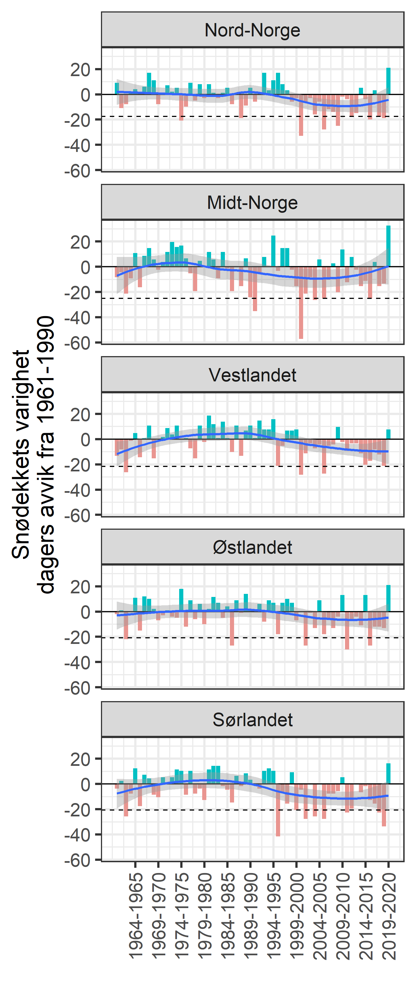

```{r setup, include=FALSE, message=FALSE}
library(knitr)
library(DT)
library(dplyr)
library(plyr)
library(readxl)
library(data.table)
library(ggplot2)
knitr::opts_chunk$set(echo = TRUE)
```


# Import

```{r}
dat <- read_excel("P:/41201042_okologisk_tilstand_fastlandsnorge_2020_dataanaly/fjell2021/data/Klima/Snodekning/mediansnowCover.xlsx")
```


```{r}
dat$year2 <- as.numeric(substr(dat$year, 6, 10))
summary(dat$year2)
```
```{r}
dat <- dat[dat$year>1960,]
```


```{r}
dat$reg  <- as.factor(dat$reg)
table(dat$reg)
```
```{r}
dat$value <- as.numeric(dat$value)
```

```{r}
ref <- aggregate(data = 
      dat[dat$year2 %between% c(1961, 1990),],
                 value~reg,
                 FUN = mean)

upp <- aggregate(data = 
      dat[dat$year2 %between% c(1961, 1990),],
                 value~reg,
                 FUN = sd)
upp$value <- upp$value*2
ref$upp <- upp$value
rm(upp)
```

# Trender

```{r}
regOrder = c(
  "Nord-Norge",
  "Midt-Norge",
  "Vestlandet",
  "Østlandet",
  "Sørlandet"
             )
```

```{r}
dat$ref <- ref$value[match(dat$reg, ref$reg)]
dat$diff <- dat$value-dat$ref

#ref$upp2 <- ref$value-ref$upp

dat$col <- ifelse(dat$diff<0, "one", "two")
```


```{r}
brk <- dat$year2[seq(5, 60, 5)] 
lab <- dat$year[seq(5, 60, 5)] 
```

```{r}
gg <- ggplot(data = dat,
       aes(x = year2, y = diff))+
  geom_bar(stat="identity", aes( fill = col))+
  geom_hline(data = ref,
        aes(yintercept = -upp),
        linetype=2)+
  geom_hline(yintercept = 0)+
  geom_smooth(data = dat,
       aes(x = year2, y = diff))+
  scale_fill_hue(l=70, c=60)+
  theme_bw(base_size = 20)+
  ylab("Snødekkets varighet\ndagers avvik fra 1961-1990")+
  xlab("")+
  theme(
    axis.text.x = element_text(angle = 90, vjust = 0.5, hjust=1))+
  scale_x_continuous(breaks = brk, labels = lab)+
  guides(fill="none")+
  facet_wrap( .~ factor(reg, levels = regOrder),
              ncol=1)
```

```{r}
png("../output/indicatorPlots/snødekkets varighet tiddserie.png", 
    units="in", width=5, height=12, res=300)
gg
dev.off()
```


Stiplalinja er 2sd under forrige normalperioden.


Bootstrapping (60% uten tilbakelegging) av gjennomsnittlig vinterregn siste 5 år. 
```{r}
new <- dat[dat$year2 %between% c(2016, 2020),]
round(tapply(new$diff, new$reg, FUN = mean), 1)
```
Tabellen over viser gjennomsnittlig reduksjon i snødekkets varighet siste 5 år.

```{r}
sno <- data.frame(
  reg = rep(levels(dat$reg), each = 10000),
  year = 2020,
  val = NA)

for(n in levels(dat$reg)){
  temp <- new[new$reg==n,]
 for(i in 1:10000){
   sno$val[i+10000*(which(levels(dat$reg)==n)-1)] <- 
     mean(sample(temp$value, 3, replace=F))
 }
}
```

# Skalering

Jeg setter den min-verdi som null dager. Dette betyr at indikatoren får verdi null når det ikke lenger er noe vinter i fjellet. 

```{r}
sno$ref <- ref$value[match(sno$reg, ref$reg)]
sno$err <- ref$upp[match(sno$reg, ref$reg)]
sno$extr <- sno$ref-sno$err

# trunkerer 
sno$valS <- ifelse( sno$val>sno$ref,
                    sno$ref,
                    sno$val)
any(sno$valS<0)

low <- sno[sno$valS<sno$extr,]
upp <- sno[sno$valS>=sno$extr,]

upp$val_scaled <- 1-((upp$ref-upp$valS)/(upp$ref-upp$extr))
upp$val_scaled2 <- 0.6+(upp$val_scaled*0.4)

low$val_scaled <- 1-((low$extr-low$valS)/(low$extr))
low$val_scaled2 <- low$val_scaled*0.6

sno_s <- rbind(upp, low)
sno_s <- select(sno_s, reg, year, val = val_scaled2)
```

```{r}
ggplot(data=sno_s, aes(x = val))+
  geom_histogram()+
  facet_wrap(.~reg)
```

# Arealvekting
```{r}
wgt <- readRDS("../data/fjellareal.rds")
wgt$Fjellareal2 <- wgt$Fjellareal/max(wgt$Fjellareal)
wgt$reg <- c("N", "C", "E", "W", "S")
```

```{r}
norge <- data.frame(
  reg = rep("Norge", 10000),
  year = 2020,
  val = NA
)

temp <- sno_s
    
temp2 <- c(
      sample(temp$val[temp$reg == "Nord-Norge"], wgt$Fjellareal2[wgt$reg == "N"]*10000, replace =T),
      sample(temp$val[temp$reg == "Østlandet"], wgt$Fjellareal2[wgt$reg == "E"]*10000, replace =T),
      sample(temp$val[temp$reg == "Vestlandet"], wgt$Fjellareal2[wgt$reg == "W"]*10000, replace =T),
      sample(temp$val[temp$reg == "Sørlandet"], wgt$Fjellareal2[wgt$reg == "S"]*10000, replace =T),
      sample(temp$val[temp$reg == "Midt-Norge"], wgt$Fjellareal2[wgt$reg == "C"]*10000, replace =T)
    )

temp3 <- sample(temp2, 10000, replace = F)
norge$val <- temp3
```

```{r}
sno2 <- rbind(sno_s, norge)
```


# Plotting


```{r, warning=FALSE, eval=F}
regOrder2 <- c(regOrder, "Norge")

myPlot <- ggplot(data = sno2, 
      aes(x = factor(reg, levels = regOrder2), 
          y = val))+
  geom_boxplot(fill = "grey", lwd=1.2)+
  
  ylab("Snødekkets varighet\nskalert mot referanseverdi")+
  xlab("")+
  scale_y_continuous(breaks = seq(0, 1, 0.2), limits=c(0,1))+
  geom_hline(yintercept = 0.6, size=1.2, linetype=2)+
  theme_bw(base_size = 20)+
  theme(
    axis.text.x = element_text(angle = 90, vjust = 0.5, hjust=1)
  )

png("../output/indicatorPlots/snødekke_boxplot.png", 
    units="in", width=10, height=7, res=300)
myPlot
dev.off()
```


# Tabell

```{r, echo=F}

finalTbl <- aggregate(data=sno2,
          val~year+reg,
          FUN= function(x) round(
            quantile(x, c(.025, .5, .975)), 2))

finalTbl <- do.call(data.frame, finalTbl)
names(finalTbl) <- c("year", "reg", "low", "med", "upp")

DT::datatable(
  finalTbl, 
  extensions = "FixedColumns",
  options = list(
    scrollX = TRUE,
    scrollY=T,
    pageLength = 10
  ))
```

```{r}
sno2$reg <- revalue(sno2$reg,
      c("Nord-Norge"="N", 
        "Midt-Norge"="C",
        "Østlandet" ="E",
        "Vestlandet"="W",
        "Sørlandet"="S"))
unique(sno2$reg)
```

# Export csv
```{r, eval=F}

write.csv(sno2, "../output/indicator_values/snodekke.csv", row.names = F)
```


