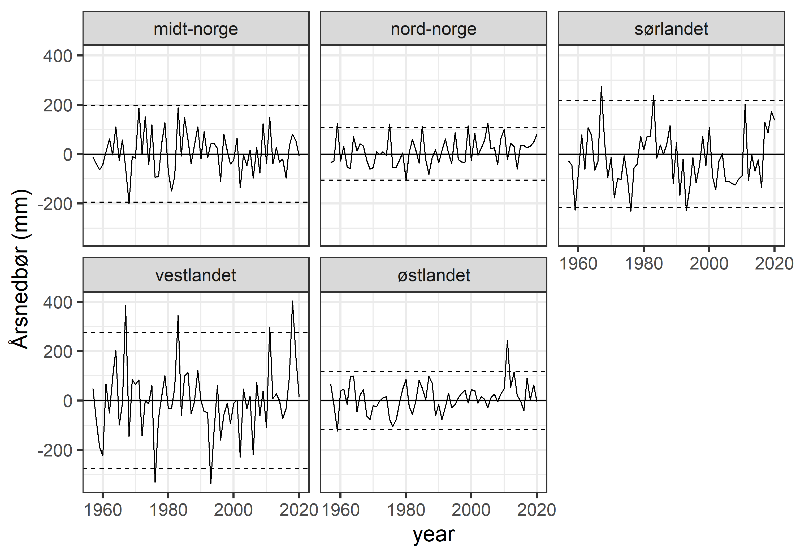
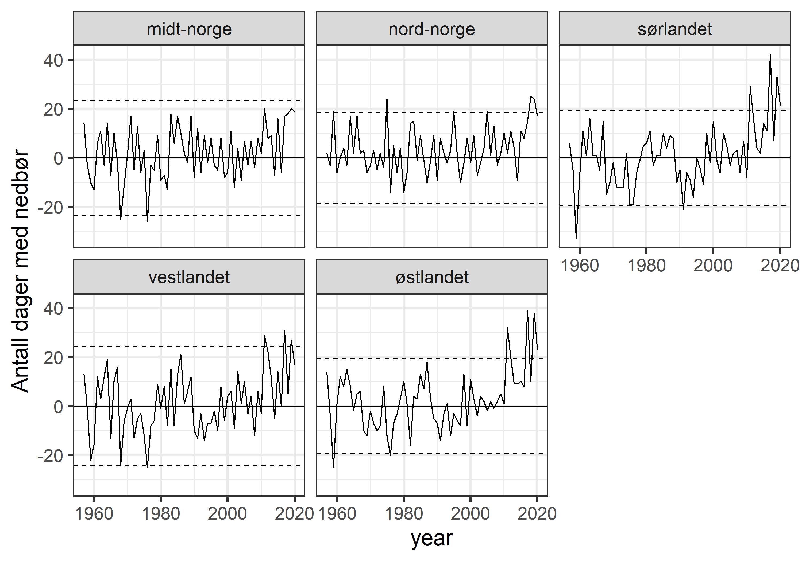

```{r setup, include=FALSE, message=FALSE}
library(knitr)
library(DT)
library(dplyr)
library(ggplot2)
knitr::opts_chunk$set(echo = TRUE)
```


Klimadata er prossesert av Markus F. Isaksen og dokumenteres i på [en annen](klima-databehandling.html) side. Her tar vi bare inn dataene og plotter de.

Disse dataene er klippet slik at det bare kommer fra fjellarealer. 

# Gjennomsnittlig årstemperatur

```{r}
aar_err <- read_excel("P:/41201042_okologisk_tilstand_fastlandsnorge_2020_dataanaly/fjell2021/data/Klima/Gjennomsnitt sommer/meanSummer_med.xlsx")
head(aar_err)
```
Her ser vi medianen og variasjonen til denne variablene under forrige normalperiode 1961-1990. La oss normalisere disse.

```{r}
names(aar_err) <- c("Region", "variable", "median", "low", "upp")

aar_err$low     <- as.numeric(aar_err$low)
aar_err$upp     <- as.numeric(aar_err$upp)
aar_err$median  <- as.numeric(aar_err$median)

aar_err$low <- 
  aar_err$low - aar_err$median
aar_err$upp <- 
  aar_err$upp - aar_err$median
```


```{r}
aar <- read_excel("P:/41201042_okologisk_tilstand_fastlandsnorge_2020_dataanaly/fjell2021/data/Klima/Gjennomsnitt sommer/meanSummer_diff.xlsx")
head(aar)
```
Her ser vi gjennomsnittlig årsnedbør siste 5 år minus gjennomsnittet i normalperioden.

```{r}
setDT(aar)
aar <- melt(aar,
            measure.vars = names(aar)[2:6],
            id.vars = "year",
            variable.name = "Region")
```


```{r}
fig_temp <- ggplot(data = aar,
                   aes(x  = year, 
                       y  = value))+
  geom_line()+
  geom_smooth()+
  ylab("Gj. årstemperatur (\u00B0C)")+
  geom_hline(yintercept=0)+
  geom_hline(data = aar_err, aes(yintercept=low), linetype=2)+
  geom_hline(data = aar_err, aes(yintercept=upp), linetype=2)+
  facet_wrap(.~Region)+
  theme_bw(base_size = 20)
  
```


# Dager med nedbør

```{r}
dager_err <- read_excel("P:/41201042_okologisk_tilstand_fastlandsnorge_2020_dataanaly/fjell2021/data/Klima/Dager med nedbør/daysPrecip_med.xlsx")
```

```{r}
names(dager_err) <- c("Region", "variable", "median", "low", "upp")

dager_err$low     <- as.numeric(dager_err$low)
dager_err$upp     <- as.numeric(dager_err$upp)
dager_err$median  <- as.numeric(dager_err$median)

dager_err$low <- 
  dager_err$low - dager_err$median
dager_err$upp <- 
  dager_err$upp - dager_err$median
```

```{r}
dager <- read_excel("P:/41201042_okologisk_tilstand_fastlandsnorge_2020_dataanaly/fjell2021/data/Klima/Dager med nedbør/daysPrecip_diff.xlsx")
```

```{r}
setDT(dager)
dager <- melt(dager,
            measure.vars = names(dager)[2:6],
            id.vars = "year",
            variable.name = "Region")
```

```{r}
fig_dager <- ggplot(data = dager)+
  geom_line(aes(x         = year, 
                y         = value))+
  ylab("Antall dager med nedbør")+
  geom_hline(yintercept=0)+
  geom_hline(data = dager_err, aes(yintercept=low), linetype=2)+
  geom_hline(data = dager_err, aes(yintercept=upp), linetype=2)+
  facet_wrap(.~Region)+
  theme_bw(base_size = 20)
```


Det er tydelig at antall dager med nedbør har økt, såpass mye at gjennomsnittet de siste fem årene på sør- og østlandet vill blitt kalt ekstremår i forrige normalperiode (over 2 standardavvik fra normalen.)

# Eksporter figurer
```{r}
png("../output/paavirkningsindikatorer/årsnedbør_tidsserie.png", 
    units="in", width=10, height=7, res=300)
fig_nedbør
dev.off()
```
```{r}
png("../output/paavirkningsindikatorer/dagerMedNedbør_tidsserie.png", 
    units="in", width=10, height=7, res=300)
fig_dager
dev.off()
```
