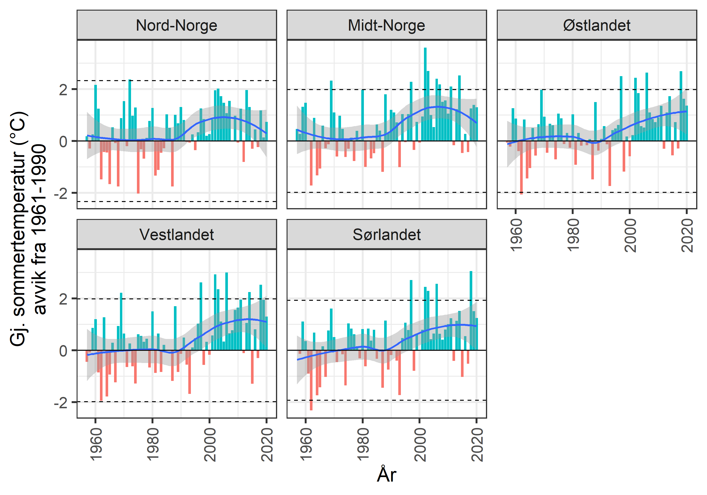
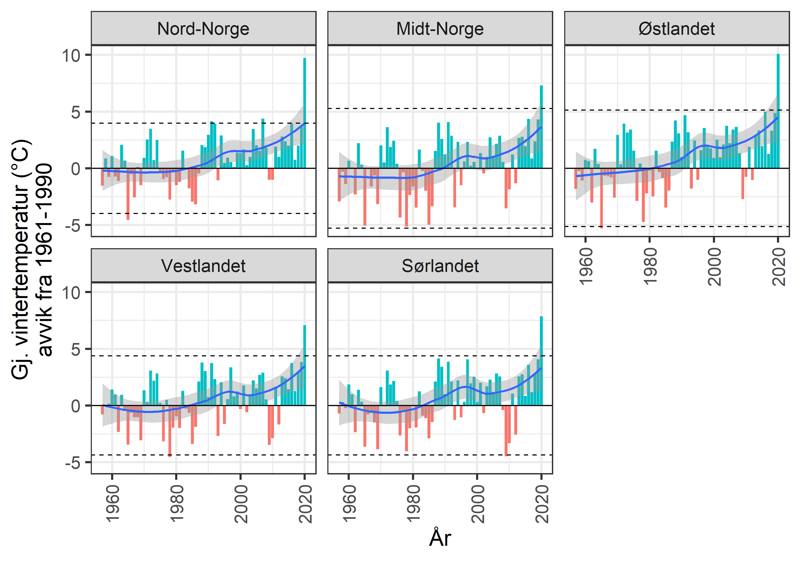
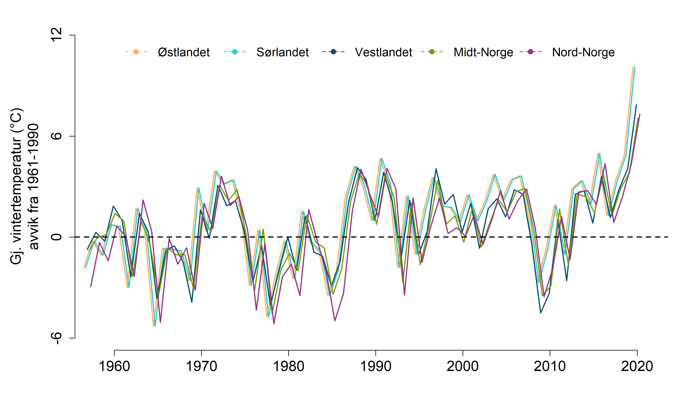

```{r setup, include=FALSE, message=FALSE}
library(knitr)
library(DT)
library(dplyr)
library(ggplot2)
library(readxl)
library(data.table)
library(plyr)
knitr::opts_chunk$set(echo = TRUE)
```


Klimadata er prossesert av Markus F. Isaksen og dokumenteres i på [en annen](klima-databehandling.html) side. Her tar vi bare inn dataene og plotter de.

Disse dataene er klippet slik at det bare kommer fra fjellarealer. 

# Gjennomsnittlig sommertemperatur

```{r}
aar_err <- read_excel("P:/41201042_okologisk_tilstand_fastlandsnorge_2020_dataanaly/fjell2021/data/Klima/Gjennomsnitt sommer/meanSummer_med.xlsx")
head(aar_err)
```
Her ser vi medianen og variasjonen til denne variablene under forrige normalperiode 1961-1990. La oss normalisere disse.

```{r}
names(aar_err) <- c("Region", "variable", "median", "low", "upp")

aar_err$low     <- as.numeric(aar_err$low)
aar_err$upp     <- as.numeric(aar_err$upp)
aar_err$median  <- as.numeric(aar_err$median)

aar_err$low <- 
  aar_err$low - aar_err$median
aar_err$upp <- 
  aar_err$upp - aar_err$median
```


```{r}
aar <- read_excel("P:/41201042_okologisk_tilstand_fastlandsnorge_2020_dataanaly/fjell2021/data/Klima/Gjennomsnitt sommer/meanSummer_diff.xlsx")
head(aar)
```
Her ser vi gjennomsnittlig årsnedbør siste 5 år minus gjennomsnittet i normalperioden.

```{r}
setDT(aar)
aar <- melt(aar,
            measure.vars = names(aar)[2:6],
            id.vars = "year",
            variable.name = "Region")
```

```{r}
levels(aar$Region)
```

```{r}
aar$Region <- plyr::revalue(aar$Region,
      c("midt-norge"="Midt-Norge", 
        "nord-norge"="Nord-Norge",
        "østlandet"="Østlandet",
        "sørlandet"="Sørlandet",
        "vestlandet"="Vestlandet"))

aar_err$Region <- plyr::revalue(aar_err$Region,
      c("midt-norge"="Midt-Norge", 
        "nord-norge"="Nord-Norge",
        "østlandet"="Østlandet",
        "sørlandet"="Sørlandet",
        "vestlandet"="Vestlandet"))
```

```{r}
regOrder = c(
  "Nord-Norge",
  "Midt-Norge",
  "Østlandet",
  "Vestlandet",
   "Sørlandet"
             )
aar$col <- ifelse(aar$value<0, "one", "two")
```

```{r}
fig_temp <- ggplot()+
  geom_bar(data = aar,
          aes(x  = year, 
              y  = value,
              fill=col),
          stat="identity")+
  geom_smooth(data = aar,
          aes(x  = year, 
              y  = value))+
  ylab("Gj. sommertemperatur (\u00B0C)\navvik fra 1961-1990")+
  xlab("År")+
  geom_hline(yintercept=0)+
  geom_hline(data = aar_err, aes(yintercept=low), linetype=2)+
  geom_hline(data = aar_err, aes(yintercept=upp), linetype=2)+
  guides(fill="none")+
  theme_bw(base_size = 20)+
  theme(
    axis.text.x = element_text(angle = 90, vjust = 0.5, hjust=1))+
  facet_wrap(.~factor(Region, levels = regOrder))
  
```


# Eksporter figurer
```{r, eval=F}
png("../output/paavirkningsindikatorer/facet plot/sommertemperatur.png", 
    units="in", width=10, height=7, res=300)
fig_temp
dev.off()
```



```{r, eval=F}
Tbl <- aar
names(Tbl) <- c("year", "reg", "diff", "col")
regOrder = c("Østlandet","Sørlandet","Vestlandet","Midt-Norge","Nord-Norge")
Tbl <- Tbl[order(match(Tbl$reg,regOrder),Tbl$year),]
minyear <- 1958
maxyear <- 2021
upperYlimit <- 6
lowYlimit   <- -3
yStep <- 3
move <- 0.2
legendPosition <- "top"
legendInset = 0
horizontal = TRUE
legendTextSize = 1.25
colours = c("#2DCCD3", "#004F71", "#7A9A01", "#93328E", "#FFB25B")
# Create loop factors
  uniq1 <- unique(unlist(Tbl$year))
  uniq2 <- unique(unlist(Tbl$reg))
  
  
  ### PLOT first Norway
  
  # Subset for region 'E'
  Norge <- subset(Tbl, reg=="Østlandet")

png("../output/paavirkningsindikatorer/enkel stil/sommertemperatur.png", 
    units="in", width=12, height=7, res=300)  

  par(mar=c(4.5,6.5,2,2))

  
 # Plot for region = 'Norge'
  plot(
    Norge$diff~Norge$year, 
    ylab="Gj. sommertemperatur (\u00B0C)\navvik fra 1961-1990",
    xlab="",
    main="",
    xlim=c(minyear, maxyear),
    ylim=c(lowYlimit, upperYlimit),
    cex.main=1,
    cex.lab=1.5,
    cex.axis=1.5,
    type="n", 
    frame.plot=FALSE,
    axes=FALSE
  )
  
  # Axis 1 options
  axis(side=1, at=c(seq(1960, 2020, by=10)), cex.axis=1.5) 
  
  
  # Axis 2 options
  axis(side=2, at=seq(lowYlimit, upperYlimit, yStep), 
       labels=seq(lowYlimit, upperYlimit, yStep), 
       cex.axis=1.5)
  
  
  # Add lines
  lines(Norge$year+(move*(-2.5)), Norge$diff, col=colours[5], lwd=2, lty=1) 
  
  # Save temp points for later addition to plot
  temppoints <- data.frame(year = Norge$year, med = Norge$diff)
  
  
  
  # Empty temporary points data frame
  temppoints3 <- data.frame()
  
  
  
  ### Then plot loop per region
  for(n in 1:(length(uniq2)-1)){
    
    # Subset for region i
    quants <- subset(Tbl, reg==uniq2[n])
    
    # Add lines
    lines(quants$year+move*(n-2.5), quants$diff, col=colours[n], lwd=2, lty=1) 
    
    # Save temp points for later addition to plot
    temppoints2 <- data.frame(year = quants$year, med = quants$diff, reg = uniq2[n])
    temppoints3 <- rbind(temppoints3, temppoints2)
    
  }
  
#  # Add points for regions
#  for(n in 1:(length(uniq2)-1)){
#    temppoints4 <- temppoints3[temppoints3$reg==uniq2[n],]
#    points(temppoints4$year+move*(n-2.5),temppoints4$diff, pch=21, #bg=colours[n], cex=1.5)
#  }
#  
#  # Add points for Norge
#  points(temppoints$year+(move*(-2.5)),temppoints$diff, pch=21, #bg=colours[5], cex=1.5)
  
  # Add legend to plot
  legend(legendPosition, legendPositionY, legend = regOrder, col = c(colours[5], colours[1:4]), 
         #bg = c(colours), 
         pch=16, lty=2,
         lwd=1.5, bty="n", inset=legendInset, title="", horiz = horizontal,
         cex=legendTextSize)
  
  # add reference line
  abline(h=0, col="black", lwd=2, lty=2)

dev.off()
  
```


# Gjennomsnittlig vintertemperatur

```{r}
aar_err <- read_excel("P:/41201042_okologisk_tilstand_fastlandsnorge_2020_dataanaly/fjell2021/data/Klima/Gjennomsnitt vinter/meanWinter_med.xlsx")
head(aar_err)
```


```{r}
names(aar_err) <- c("Region", "variable", "median", "low", "upp")

aar_err$low     <- as.numeric(aar_err$low)
aar_err$upp     <- as.numeric(aar_err$upp)
aar_err$median  <- as.numeric(aar_err$median)

aar_err$low <- 
  aar_err$low - aar_err$median
aar_err$upp <- 
  aar_err$upp - aar_err$median
```


```{r}
aar <- read_excel("P:/41201042_okologisk_tilstand_fastlandsnorge_2020_dataanaly/fjell2021/data/Klima/Gjennomsnitt vinter/meanWinter_diff.xlsx")
head(aar)
```
Her ser vi gjennomsnittlig årsnedbør siste 5 år minus gjennomsnittet i normalperioden.

```{r}
setDT(aar)
aar <- melt(aar,
            measure.vars = names(aar)[2:6],
            id.vars = "year",
            variable.name = "Region")
```

```{r}
levels(aar$Region)
```

```{r}
aar$Region <- plyr::revalue(aar$Region,
      c("midt-norge"="Midt-Norge", 
        "nord-norge"="Nord-Norge",
        "østlandet"="Østlandet",
        "sørlandet"="Sørlandet",
        "vestlandet"="Vestlandet"))

aar_err$Region <- plyr::revalue(aar_err$Region,
      c("midt-norge"="Midt-Norge", 
        "nord-norge"="Nord-Norge",
        "østlandet"="Østlandet",
        "sørlandet"="Sørlandet",
        "vestlandet"="Vestlandet"))
```

```{r}
regOrder = c(
  "Nord-Norge",
  "Midt-Norge",
  "Østlandet",
  "Vestlandet",
   "Sørlandet"
             )
aar$col <- ifelse(aar$value<0, "one", "two")
```

```{r}
fig_temp <- ggplot()+
  geom_bar(stat="identity",
           data = aar,
                   aes(x  = year, 
                       y  = value,
                       fill=col))+
  geom_smooth(data = aar,
                   aes(x  = year, 
                       y  = value))+
  ylab("Gj. vintertemperatur (\u00B0C)\navvik fra 1961-1990")+
  xlab("År")+
  geom_hline(yintercept=0)+
  geom_hline(data = aar_err, aes(yintercept=low), linetype=2)+
  geom_hline(data = aar_err, aes(yintercept=upp), linetype=2)+
  theme_bw(base_size = 20)+
  theme(
    axis.text.x = element_text(angle = 90, vjust = 0.5, hjust=1))+
  guides(fill="none")+
  facet_wrap(.~factor(Region, levels = regOrder))

  
```


# Eksporter figurer
```{r, eval=F}
png("../output/paavirkningsindikatorer/facet plot/vintertemperatur.png", 
    units="in", width=10, height=7, res=300)
fig_temp
dev.off()
```



```{r, eval=F}
Tbl <- aar
names(Tbl) <- c("year", "reg", "diff", "col")
regOrder = c("Østlandet","Sørlandet","Vestlandet","Midt-Norge","Nord-Norge")
Tbl <- Tbl[order(match(Tbl$reg,regOrder),Tbl$year),]
minyear <- 1958
maxyear <- 2021
upperYlimit <- 12
lowYlimit   <- -6
yStep <- 6
move <- 0.2
legendPosition <- "top"
legendInset = 0
horizontal = TRUE
legendTextSize = 1.25
colours = c("#2DCCD3", "#004F71", "#7A9A01", "#93328E", "#FFB25B")
# Create loop factors
  uniq1 <- unique(unlist(Tbl$year))
  uniq2 <- unique(unlist(Tbl$reg))
  
  
  ### PLOT first Norway
  
  # Subset for region 'E'
  Norge <- subset(Tbl, reg=="Østlandet")

png("../output/paavirkningsindikatorer/enkel stil/vintertemperatur.png", 
    units="in", width=12, height=7, res=300)  
   par(mar=c(4.5,6.5,2,2))
 
 # Plot for region = 'Norge'
  plot(
    Norge$diff~Norge$year, 
    ylab="Gj. vintertemperatur (\u00B0C)\navvik fra 1961-1990",
    xlab="",
    main="",
    xlim=c(minyear, maxyear),
    ylim=c(lowYlimit, upperYlimit),
    cex.main=1,
    cex.lab=1.5,
    cex.axis=1.5,
    type="n", 
    frame.plot=FALSE,
    axes=FALSE
  )
  
  # Axis 1 options
  axis(side=1, at=c(seq(1960, 2020, by=10)), cex.axis=1.5) 
  
  
  # Axis 2 options
  axis(side=2, at=seq(lowYlimit, upperYlimit, yStep), 
       labels=seq(lowYlimit, upperYlimit, yStep), 
       cex.axis=1.5)
  
  
  # Add lines
  lines(Norge$year+(move*(-2.5)), Norge$diff, col=colours[5], lwd=2, lty=1) 
  
  # Save temp points for later addition to plot
  temppoints <- data.frame(year = Norge$year, med = Norge$diff)
  
  
  
  # Empty temporary points data frame
  temppoints3 <- data.frame()
  
  
  
  ### Then plot loop per region
  for(n in 1:(length(uniq2)-1)){
    
    # Subset for region i
    quants <- subset(Tbl, reg==uniq2[n])
    
    # Add lines
    lines(quants$year+move*(n-2.5), quants$diff, col=colours[n], lwd=2, lty=1) 
    
    # Save temp points for later addition to plot
    temppoints2 <- data.frame(year = quants$year, med = quants$diff, reg = uniq2[n])
    temppoints3 <- rbind(temppoints3, temppoints2)
    
  }
  
  # Add points for regions
  for(n in 1:(length(uniq2)-1)){
    temppoints4 <- temppoints3[temppoints3$reg==uniq2[n],]
    points(temppoints4$year+move*(n-2.5),temppoints4$diff, pch=21, bg=colours[n], cex=1.5)
  }
  
  # Add points for Norge
  points(temppoints$year+(move*(-2.5)),temppoints$diff, pch=21, bg=colours[5], cex=1.5)
  
  # Add legend to plot
  legend(legendPosition, legendPositionY, legend = regOrder, col = c(colours[5], colours[1:4]), 
         #bg = c(colours), 
         pch=16, lty=2,
         lwd=1.5, bty="n", inset=legendInset, title="", horiz = horizontal,
         cex=legendTextSize)
  
  # add reference line
  abline(h=0, col="black", lwd=2, lty=2)

dev.off()
  
```

