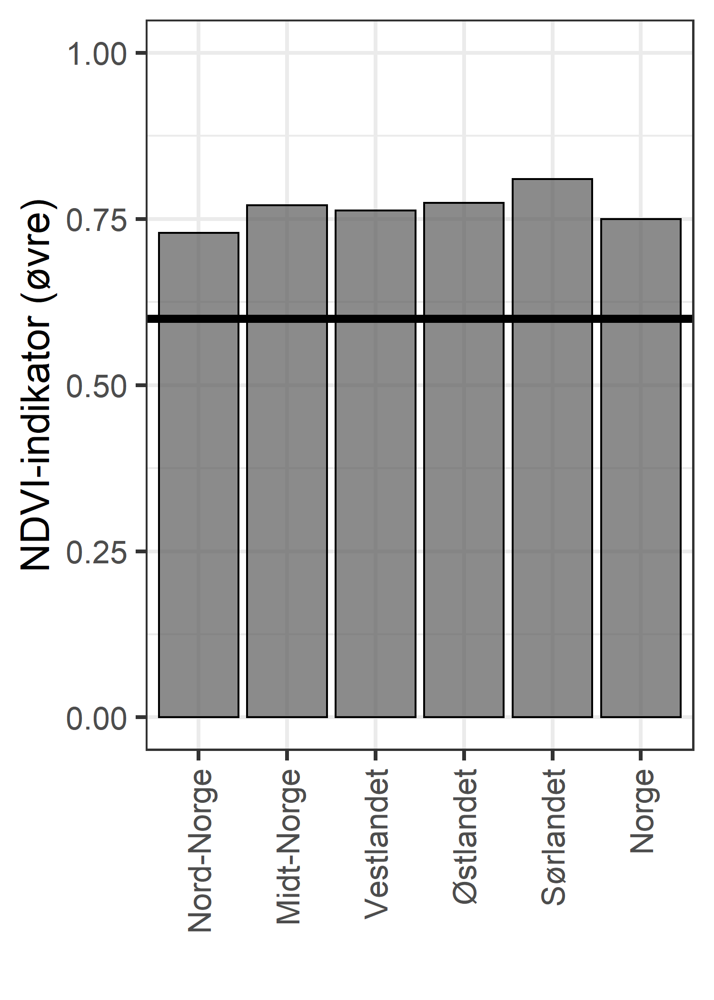
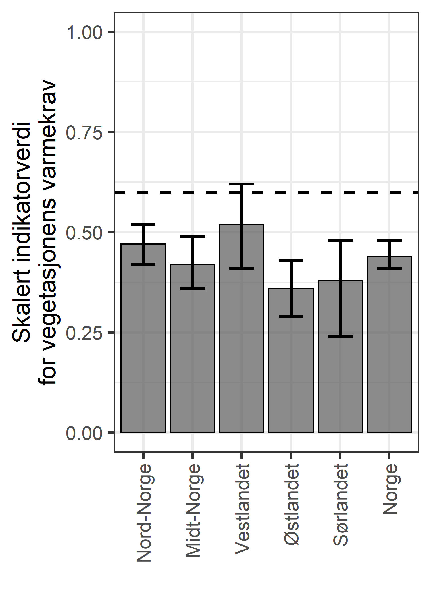

```{r setup, include=FALSE, message=FALSE}
library(knitr)
library(DT)
library(ggplot2)
library(ggpubr)
library(dplyr)
library(plyr)
knitr::opts_chunk$set(echo = TRUE)
```

# Start

Joachim Töpper har levert te datasett med bootstrappede indikatorverdier. Disse er på et noe annet format enn de andre datasettene og må klargjøres for plotting og for at de skal inngå i aggregerte tilstandsberegninger. 

```{r}
ell <- read.csv("../output/indicator_values/ellenberg_alien.csv", header=T)

```

```{r}
unique(ell$var_name)
```
```{r}
unique(ell$reg)
```

# Fremmede arter

```{r}
alien <- ell[ell$var_name=="alien", c("reg", "val") ]
alien$year <- 2020
table(alien$reg)
```


```{r, echo=F}

finalTbl <- aggregate(data=alien,
          val~reg+year,
          FUN= function(x) round(
            quantile(x, c(.025, .5, .975)), 2))

finalTbl <- do.call(data.frame, finalTbl)
names(finalTbl) <- c("year", "reg", "low", "med", "upp")

DT::datatable(
  finalTbl, 
  extensions = "FixedColumns",
  options = list(
    scrollX = TRUE,
    scrollY=T,
    pageLength = 10
  ))
```
Det er ikke noe vits å lage en figur fo denne.

```{r, eval=F}
write.csv(alien, "../output/indicator_values/alien.csv")
```

# Ellenberg L


Først en liten test av hvor mange ruter som inngår i hver indikator. 

```{r}
temp <- ell[ell$var_name=="EllL1", c("reg", "plotsL1_tot") ]
temp <- aggregate(data=temp,
          plotsL1_tot~reg,
          FUN= function(x) round(
            quantile(x, c(.025, .5, .975)), 2))

temp <- do.call(data.frame, temp)
names(temp) <- c("reg", "low", "med", "upp")

DT::datatable(
  temp, 
  extensions = "FixedColumns",
  options = list(
    scrollX = TRUE,
    scrollY=T,
    pageLength = 10
  ))

```
Det første vi ser er at det er kun en verdi per region, altså ingen variasjon, og det gir mening.


```{r}
temp2 <- ell[ell$var_name=="EllL2", c("reg", "plotsL2_tot") ]
temp2 <- aggregate(data=temp2,
          plotsL2_tot~reg,
          FUN= function(x) round(
            quantile(x, c(.025, .5, .975)), 2))

temp2 <- do.call(data.frame, temp2)
names(temp2) <- c("reg", "low", "med", "upp")

temp$skaleringsmetode <- "Nedre"
temp2$skaleringsmetode <- "Øvre"
temp3 <- rbind(temp, temp2)
```

```{r}
ggplot(data=temp3, aes(x = reg, y = med, group=skaleringsmetode, fill = skaleringsmetode))+
  geom_bar(stat = "identity", position = "dodge")+
  ylab("Antall ruter totalt")
```

Det er ganske få ruter for den nedre-skalerte indikatoren på sør- og vestlandet, noe som kan gjøre det vanskelig å si noe om denne indikatoren på regionalt nivå.


## Low

```{r}
ell_L_low <- ell[ell$var_name=="EllL1", c("reg", "val", "plotsL1_tot") ]
ell_L_low$year <- 2020
table(ell_L_low$reg)
```

```{r, echo=F}

finalTbl <- aggregate(data=ell_L_low,
          val~year+reg,
          FUN= function(x) round(
            quantile(x, c(.025, .5, .975)), 2))

finalTbl <- do.call(data.frame, finalTbl)
names(finalTbl) <- c("year", "reg", "low", "med", "upp")

DT::datatable(
  finalTbl, 
  extensions = "FixedColumns",
  options = list(
    scrollX = TRUE,
    scrollY=T,
    pageLength = 10
  ))
```

Veldig høye verdier - liten vits å lage en figur for denne indikatoren også.

```{r, eval=F}
write.csv(ell_L_low, "../output/indicator_values/ell_L_low.csv")
```

## High


```{r}
ell_L_high <- ell[ell$var_name=="EllL2", c("reg", "val", "plotsL2_tot") ]
ell_L_high$year <- 2020
table(ell_L_high$reg)
```

```{r, eval=F}
write.csv(ell_L_high, "../output/indicator_values/ell_L_high.csv")
```

```{r, echo=F}

finalTbl2 <- aggregate(data=ell_L_high,
          val~year+reg,
          FUN= function(x) round(
            quantile(x, c(.025, .5, .975)), 2))

finalTbl2 <- do.call(data.frame, finalTbl2)
names(finalTbl2) <- c("year", "reg", "low", "med", "upp")

DT::datatable(
  finalTbl2, 
  extensions = "FixedColumns",
  options = list(
    scrollX = TRUE,
    scrollY=T,
    pageLength = 10
  ))
```
Veldig høye verdier - liten vits å lage en figur for denne indikatoren også.

Hvor korrelerte er de to Ellenberg L indikatorene?

```{r}
temp <- data.frame(
  vals = c(finalTbl$med, finalTbl2$med),
  lower = c(finalTbl$low, finalTbl2$low),
  upper = c(finalTbl$upp, finalTbl2$upp),
  var = rep(c("low", "upp"), each=6),
  reg = rep(finalTbl$reg, 2))

ggplot(data = temp, aes(x = factor(reg), y = vals, colour = var))+
         geom_point(size=5, position = position_dodge(0.1))+
  geom_errorbar(aes(ymin=lower, ymax=upper),position =  position_dodge(0.1))+
  ylab("Scalert indikator for Ellenberg L")+
  xlab("Region")
```

De er veldig korrelerte.

# Ellenberg N

Igjen, en liten test av hvor mange ruter som inngår i hver indikator. 

```{r}
temp <- ell[ell$var_name=="EllN1", c("reg", "plotsN1_tot") ]
temp <- aggregate(data=temp,
          plotsN1_tot~reg,
          FUN= median)

names(temp) <- c("reg", "med")

temp2 <- ell[ell$var_name=="EllN2", c("reg", "plotsN2_tot") ]
temp2 <- aggregate(data=temp2,
          plotsN2_tot~reg,
          FUN= median)

names(temp2) <- c("reg", "med")

temp$skaleringsmetode <- "Nedre"
temp2$skaleringsmetode <- "Øvre"
temp3 <- rbind(temp, temp2)


```

```{r}
ggplot(data=temp3, aes(x = reg, y = med, group=skaleringsmetode, fill = skaleringsmetode))+
  geom_bar(stat = "identity", position = "dodge")+
  ylab("Antall ruter totalt")
```

I motsettning til Ellenberg L er det for Ellenberg N den nedre skaleringen som er vanligst, dvs, flest ruter ligger under referanseverdien.

## Low

```{r}
ell_N_low <- ell[ell$var_name=="EllN1", c("reg", "val", "plotsN1_tot") ]
ell_N_low$year <- 2020
table(ell_N_low$reg)
```

```{r, echo=F}

finalTbl <- aggregate(data=ell_N_low,
          val~year+reg,
          FUN= function(x) round(
            quantile(x, c(.025, .5, .975)), 2))

finalTbl <- do.call(data.frame, finalTbl)
names(finalTbl) <- c("year", "reg", "low", "med", "upp")

DT::datatable(
  finalTbl, 
  extensions = "FixedColumns",
  options = list(
    scrollX = TRUE,
    scrollY=T,
    pageLength = 10
  ))
```

Veldig høye verdier - liten vits å lage en figur for denne indikatoren også.

```{r, eval=F}
write.csv(ell_N_low, "../output/indicator_values/ell_N_low.csv")
```

## High


```{r}
ell_N_high <- ell[ell$var_name=="EllN2", c("reg", "val", "plotsN2_tot") ]
ell_N_high$year <- 2020
table(ell_N_high$reg)
```

```{r, echo=F}

finalTbl <- aggregate(data=ell_N_high,
          val~year+reg,
          FUN= function(x) round(
            quantile(x, c(.025, .5, .975)), 2))

finalTbl <- do.call(data.frame, finalTbl)
names(finalTbl) <- c("year", "reg", "low", "med", "upp")

DT::datatable(
  finalTbl, 
  extensions = "FixedColumns",
  options = list(
    scrollX = TRUE,
    scrollY=T,
    pageLength = 10
  ))
```

Veldig høye verdier - liten vits å lage en figur for denne indikatoren også.

```{r, eval=F}
write.csv(ell_N_high, "../output/indicator_values/ell_N_high.csv")
```

# Ellenberg R

Jeg venter med denne siden jeg mener den kanskje ikke bør inkluderes.


```{r, eval =F, include=F}
rm(ell, ell_L_high, ell_L_low, ell_N_high, ell_N_low, finalTbl, finalTbl2, temp, temp2, temp3, reg, vals, var)
```


# NDVI

```{r}
ndvi <- read.csv("../data/ndvi.fjell.boot.csv", header=T)
head(ndvi)
```


```{r}
en <- ggplot(data=ndvi)+
  geom_histogram(aes(x = slope))+
  geom_vline(xintercept = 0)

to <- ggplot(data=ndvi)+
  geom_histogram(aes(x = ndvi.index.l))

tre <- ggplot(data=ndvi)+
  geom_histogram(aes(x = ndvi.index.u))

ggpubr::ggarrange(en, to, tre,
                  ncol=1)
```

Slope her er egentlig gjennomsnittlig slope (endring i ndvi verdi mellom to tidsperioder) etter 100% bootstrapping med tilbakelegging. Selv om ingen av disse verdiene er under null kan det være inkelte celler som er under null (negativ utvikling i NDVI).

Indikatorverdiene er også produsert ved boostrapping av pixseler og fordelingen representerer derfor en romlig varisjon, og ikke en metodisk usikkerhet. Derfor vil jeg ikke bruke denne fordelingen videne, men basere meg kun på gjennomsnittet fra bootstrappingen.

Den øvre- og nedre-skalerte indikatoren bør vektes utifra antall pixler som inngår. En pixel kan bare brukes i en av indikatorene. Det er stor overvekt av pixsler som viser en positiv utvikling i NDVI slik at jeg bruker kun den øvre-skalerte indikatoren nå i førtse omgang til jeg får vektingstallene fra Joackim. 

Regionene har rare navn.

```{r}
unique(ndvi$region)
```
```{r}
ndvi$region <- plyr::revalue(ndvi$region,
                             c("M" = "C",
                               "V" = "W",
                               "A" = "E"))
```


```{r}
ndvi2 <- aggregate(data=ndvi,
                   ndvi.index.u~region,
                   FUN = mean)
names(ndvi2) <- c("reg", "val")
ndvi2$X <- "NDVI"
ndvi2
```

```{r}
ndvi2$reg <- plyr::revalue(ndvi2$reg,
      c("C" = "Midt-Norge", 
        "N" = "Nord-Norge",
        "Norge" = "Norge",
        "E" = "Østlandet",
        "S" = "Sørlandet",
        "W" = "Vestlandet"))

regOrder = c(
  "Nord-Norge",
  "Midt-Norge",
  "Vestlandet",
  "Østlandet",
  "Sørlandet",
  "Norge"
             )
```

```{r}
ggndvi <- ggplot(data = ndvi2, aes(x = factor(reg, levels=regOrder), y = val))+
  geom_bar(stat="identity", alpha=.7, colour = "black")+
  ylim(c(0,1))+
  theme_bw(base_size = 20)+
  theme(
    axis.text.x = element_text(angle = 90, vjust = 0.5, hjust=1)
  )+
  geom_hline(yintercept = 0.6, size=1.2, linetype=2)+
  geom_hline(yintercept = 0.6, size=2)+
  ylab("NDVI-indikator (øvre)")+
  xlab("")
```

```{r, eval=F}
png("../output/indicatorPlots/ndvi_barplot.png", 
    units="in", width=5, height=7, res=300)
ggndvi
dev.off()
```


```{r, eval=F}
write.csv(ndvi2, "../output/indicator_values/ndvi.csv")
```


# Varmekrav

```{r}
heat <- read.csv("../output/indicator_values/heat_req.csv", header=T)
head(heat)
```

```{r}
heat$year <- 2020
heat <- select(heat, reg, year, val)
heat$X <- "vamrmekrav"
```

```{r, echo=F}

finalTbl <- aggregate(data=heat,
          val~year+reg,
          FUN= function(x) round(
            quantile(x, c(.025, .5, .975)), 2))

finalTbl <- do.call(data.frame, finalTbl)

names(finalTbl) <- c("year", "reg", "low", "med", "upp")

DT::datatable(
  finalTbl, 
  extensions = "FixedColumns",
  options = list(
    scrollX = TRUE,
    scrollY=T,
    pageLength = 10
  ))
```
Her var det store avvik.
```{r}
finalTbl$reg <- plyr::revalue(finalTbl$reg,
      c("C" = "Midt-Norge", 
        "N" = "Nord-Norge",
        "Norge" = "Norge",
        "E" = "Østlandet",
        "S" = "Sørlandet",
        "W" = "Vestlandet"))

regOrder = c(
  "Nord-Norge",
  "Midt-Norge",
  "Vestlandet",
  "Østlandet",
  "Sørlandet",
  "Norge"
             )
```


```{r}
ggheat <- ggplot(data = finalTbl, aes(x = factor(reg, levels=regOrder), y = med))+
  geom_bar(stat="identity", alpha=.7, colour="black")+
  geom_errorbar(aes(ymin=low, ymax=upp),
                width=0.5, size=1.2)+
  ylim(c(0,1))+
  theme_bw(base_size = 20)+
  theme(
    axis.text.x = element_text(angle = 90, vjust = 0.5, hjust=1)
  )+
  geom_hline(yintercept = 0.6, size=1.2, linetype=2)+
  ylab("Skalert indikatorverdi\nfor vegetasjonens varmekrav")+
  xlab("")

```
```{r, eval=F}
png("../output/indicatorPlots/varmekrav_barplot.png", 
    units="in", width=5, height=7, res=300)
ggheat
dev.off()
```




```{r, eval=F}
write.csv(heat, "../output/indicator_values/varmekrav.csv")
```