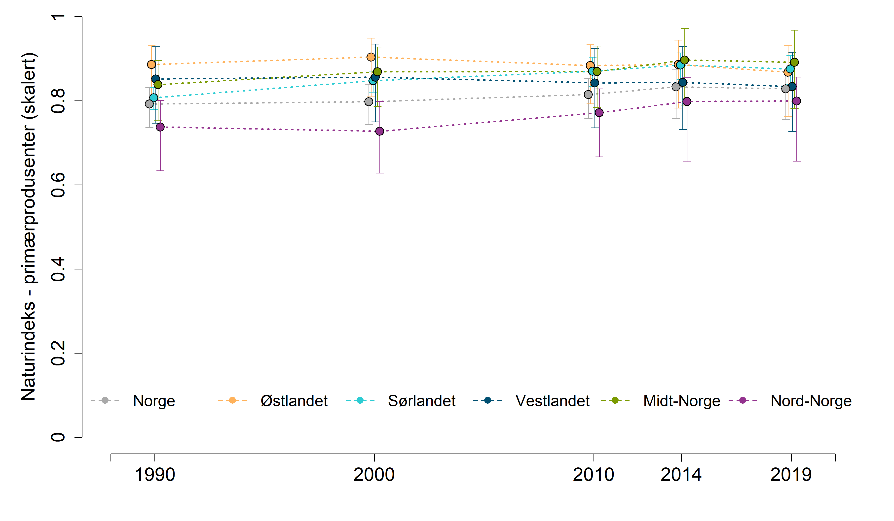
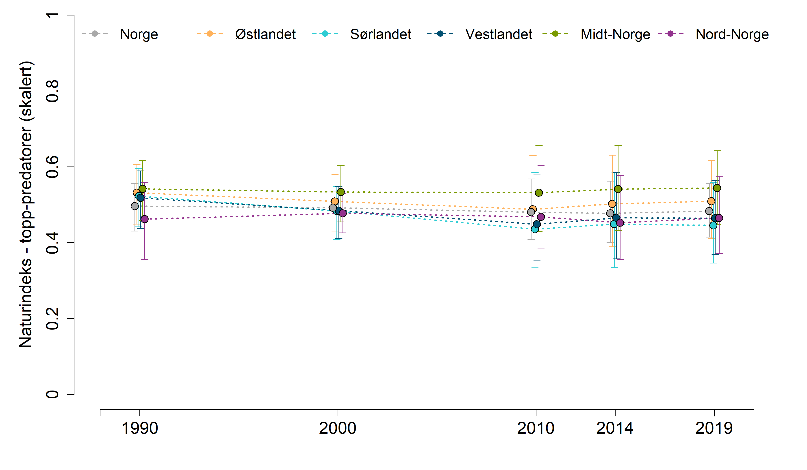

```{r setup, include=FALSE, message=FALSE}
library(knitr)
library(DT)
library(dplyr)
library(ggplot2)
library(readxl)
library(data.table)
knitr::opts_chunk$set(echo = TRUE)
```

Disse analysene ble gjort av Simon Jakobsson i forbindelse med skograpporten. Her tar jeg bare inn data igjen for å plotte de.
Se: P:/41201042_okologisk_tilstand_fastlandsnorge_2020_dataanaly/FINAL/Scripts/Indicators/NI2020-data-functional.R

Her viser hvilke arter som inngår i de ulike gruppene.
```{r}
arter <- read.csv("P:/41201042_okologisk_tilstand_fastlandsnorge_2020_dataanaly/FINAL/Raw_data/NI2020-data/Script-based/alpine_functional.csv", header=T, sep = ";", encoding = "UTF-8")

names(arter)[1] <- "art"

DT::datatable(arter[,c(1,3)],
              options = list(
    scrollX = TRUE,
    scrollY=T,
    pageLength = 30))
```








## Plotting
Her er scriptene som lager figurene over.


```{r}
eval(parse("indicator_plots2.R", encoding="UTF-8"))

```


Data:
```{r}
mellom <- read.csv("P:/41201042_okologisk_tilstand_fastlandsnorge_2020_dataanaly/FINAL/Indicator_values/Alpine/Index_Mellompredator.csv", header=T)

herb <- read.csv("P:/41201042_okologisk_tilstand_fastlandsnorge_2020_dataanaly/FINAL/Indicator_values/Alpine/Index_Plante- og filterspisere.csv", header=T)

prim <- read.csv("P:/41201042_okologisk_tilstand_fastlandsnorge_2020_dataanaly/FINAL/Indicator_values/Alpine/Index_Primærprodusent.csv", header=T)

topp <- read.csv("P:/41201042_okologisk_tilstand_fastlandsnorge_2020_dataanaly/FINAL/Indicator_values/Alpine/Index_Topp-predator.csv", header=T)

```


```{r, eval=F}
png("../output/supplerende indikatorer/mellompredatorer.png", 
    units="in", width=12, height=7, res=300)

par(mfrow=c(1,1), mar=c(4.5,
                        5.5,
                        0,
                        2))

indicator_plot2(dataset = mellom,
               yAxisTitle = "Naturindeks - mellompredatorer (skalert)",
               lowYlimit = 0,
               upperYlimit = 1,
               yStep = .2,
               minyear = 1988,
               maxyear = 2021,
               colours = c("#FFB25B", "#2DCCD3", "#004F71", "#7A9A01", "#93328E", "dark grey"),
               legendPosition = "top",
               legendInset = 0.8,
               move = 0.1,
               horizontal = T,
               legendTextSize = 1.25)
dev.off()
```

```{r, eval=F}
png("../output/supplerende indikatorer/plantespisere.png", 
    units="in", width=12, height=7, res=300)

par(mfrow=c(1,1), mar=c(4.5,
                        5.5,
                        0,
                        2))

indicator_plot2(dataset = herb,
               yAxisTitle = "Naturindeks - plantespisere (skalert)",
               lowYlimit = 0,
               upperYlimit = 1,
               yStep = .2,
               minyear = 1988,
               maxyear = 2021,
               colours = c("#FFB25B", "#2DCCD3", "#004F71", "#7A9A01", "#93328E", "dark grey"),
               legendPosition = "top",
               legendInset = 0,
               move = 0.1,
               horizontal = T,
               legendTextSize = 1.25)
dev.off()
```

```{r, eval=F}
png("../output/supplerende indikatorer/primaerprodusenter.png", 
    units="in", width=12, height=7, res=300)

par(mfrow=c(1,1), mar=c(4.5,
                        5.5,
                        0,
                        2))

indicator_plot2(dataset = prim,
               yAxisTitle = "Naturindeks - primærprodusenter (skalert)",
               lowYlimit = 0,
               upperYlimit = 1,
               yStep = .2,
               minyear = 1988,
               maxyear = 2021,
               colours = c("#FFB25B", "#2DCCD3", "#004F71", "#7A9A01", "#93328E", "dark grey"),
               legendPosition = "top",
               legendInset = 0.8,
               move = 0.1,
               horizontal = T,
               legendTextSize = 1.25)
dev.off()
```

```{r, eval=F}
png("../output/supplerende indikatorer/topp-predatorer.png", 
    units="in", width=12, height=7, res=300)

par(mfrow=c(1,1), mar=c(4.5,
                        5.5,
                        0,
                        2))

indicator_plot2(dataset = topp,
               yAxisTitle = "Naturindeks - topp-predatorer (skalert)",
               lowYlimit = 0,
               upperYlimit = 1,
               yStep = .2,
               minyear = 1988,
               maxyear = 2021,
               colours = c("#FFB25B", "#2DCCD3", "#004F71", "#7A9A01", "#93328E", "dark grey"),
               legendPosition = "top",
               legendInset = 0,
               move = 0.1,
               horizontal = T,
               legendTextSize = 1.25)
dev.off()
```

Alle fire figurene combinert
```{r, eval=F}
png("../output/supplerende indikatorer/naturindeks - funksjonelle grupper.png", 
    units="in", width=10, height=20, res=300)

par(mfrow=c(4,1), mar=c(4.5,
                        5.5,
                        0,
                        2))

indicator_plot2(dataset = topp,
               yAxisTitle = "Naturindeks - topp-predatorer (skalert)",
               lowYlimit = 0,
               upperYlimit = 1,
               yStep = .2,
               minyear = 1988,
               maxyear = 2021,
               colours = c("#FFB25B", "#2DCCD3", "#004F71", "#7A9A01", "#93328E", "dark grey"),
               legendPosition = "top",
               legendInset = 0,
               move = 0.1,
               horizontal = T,
               legendTextSize = 1.5)

indicator_plot2(dataset = mellom,
               yAxisTitle = "Naturindeks - mellompredatorer (skalert)",
               lowYlimit = 0,
               upperYlimit = 1,
               yStep = .2,
               minyear = 1988,
               maxyear = 2021,
               colours = c("#FFB25B", "#2DCCD3", "#004F71", "#7A9A01", "#93328E", "dark grey"),
               legendPosition = "top",
               legendInset = -1,
               move = 0.1,
               horizontal = T,
               legendTextSize = 1.25)

indicator_plot2(dataset = herb,
               yAxisTitle = "Naturindeks - plantespisere (skalert)",
               lowYlimit = 0,
               upperYlimit = 1,
               yStep = .2,
               minyear = 1988,
               maxyear = 2021,
               colours = c("#FFB25B", "#2DCCD3", "#004F71", "#7A9A01", "#93328E", "dark grey"),
               legendPosition = "top",
               legendInset = -10,
               move = 0.1,
               horizontal = T,
               legendTextSize = 1.25)

indicator_plot2(dataset = prim,
               yAxisTitle = "Naturindeks - primærprodusenter (skalert)",
               lowYlimit = 0,
               upperYlimit = 1,
               yStep = .2,
               minyear = 1988,
               maxyear = 2021,
               colours = c("#FFB25B", "#2DCCD3", "#004F71", "#7A9A01", "#93328E", "dark grey"),
               legendPosition = "top",
               legendInset = -1,
               move = 0.1,
               horizontal = T,
               legendTextSize = 1.25)
dev.off()

```
