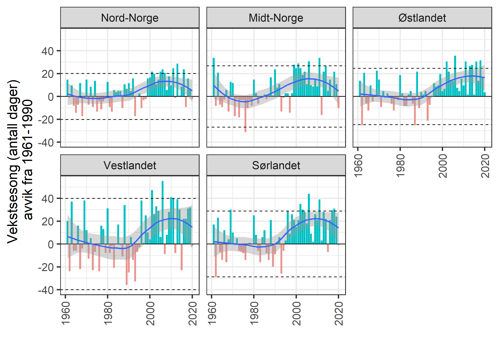

```{r setup, include=FALSE, message=FALSE}
library(knitr)
library(DT)
library(dplyr)
library(ggplot2)
library(readxl)
library(data.table)
library(plyr)
knitr::opts_chunk$set(echo = TRUE)
```


Klimadata er prossesert av Markus F. Isaksen og dokumenteres i på [en annen](klima-databehandling.html) side. Her tar vi bare inn dataene og plotter de.

Disse dataene er klippet slik at det bare kommer fra fjellarealer. 

# Gjennomsnittlig lengde på vekstsesong
Dette er definert som antall dager med middeltemperature over 5 grader C.


# Import
```{r}
dat <- read_excel("P:/41201042_okologisk_tilstand_fastlandsnorge_2020_dataanaly/fjell2021/data/Klima/Vekstsesong/growthSeason_med.xlsx")
```


```{r}
dat$year <- as.numeric(dat$year)
dat$value <- as.numeric(dat$value)

summary(dat$value)
```

```{r}
dat <- dat[dat$year>1960,]
```


```{r}
dat$reg  <- as.factor(dat$reg)
table(dat$reg)
```

Regner ut referanseverdien og 2SD av denne.
```{r}
ref <- aggregate(data = 
      dat[dat$year %between% c(1961, 1990),],
                 value~reg,
                 FUN = mean)

upp <- aggregate(data = 
      dat[dat$year %between% c(1961, 1990),],
                 value~reg,
                 FUN = sd)
upp$value <- upp$value*2
ref$upp <- upp$value
rm(upp)
```

# Trender

```{r}
regOrder = c(
  "Nord-Norge",
  "Midt-Norge",
  "Østlandet",
  "Vestlandet",
   "Sørlandet"
             )
```

```{r}
dat$ref <- ref$value[match(dat$reg, ref$reg)]
dat$diff <- dat$value-dat$ref
dat$col <- ifelse(dat$diff<0, "one", "two")
```


```{r, eval=F}
gg <- ggplot(data = dat,
       aes(x = year, y = diff))+
  geom_bar(stat="identity", aes( fill = col))+
  geom_hline(data = ref,
        aes(yintercept = -upp),
        linetype=2)+
  geom_hline(data = ref,
        aes(yintercept = upp),
        linetype=2)+
  geom_hline(yintercept = 0)+
  geom_smooth(data = dat,
       aes(x = year, y = diff))+
  scale_fill_hue(l=70, c=60)+
  theme_bw(base_size = 20)+
  ylab("Vekstsesong (antall dager)\n avvik fra 1961-1990")+
  xlab("")+
  theme(
    axis.text.x = element_text(angle = 90, vjust = 0.5, hjust=1))+
  #scale_x_continuous(breaks = brk, labels = lab)+
  guides(fill="none")+
  facet_wrap( .~ factor(reg, levels = regOrder),
              ncol=3)
```

```{r, eval=F}
png("../output/paavirkningsindikatorer/facet plot/vekstsesong normalisert tiddserie med barplot.png", 
    units="in", width=5, height=12, res=300)
gg
dev.off()
```


Stiplalinja er 2sd under forrige normalperioden.

Her er en forenklet figur i ØT-stilen.

```{r, eval=F}
Tbl <- dat
Tbl <- select(Tbl, reg, diff , year)
regOrder = c("Østlandet","Sørlandet","Vestlandet","Midt-Norge","Nord-Norge")
Tbl <- Tbl[order(match(Tbl$reg,regOrder),Tbl$year),]
minyear <- 1958
maxyear <- 2021
upperYlimit <- 80
lowYlimit   <- -40
yStep <- 40
move <- 0.2
legendPosition <- "top"
legendInset = 0
horizontal = TRUE
legendTextSize = 1.25
colours = c("#2DCCD3", "#004F71", "#7A9A01", "#93328E", "#FFB25B")
# Create loop factors
  uniq1 <- unique(unlist(Tbl$year))
  uniq2 <- unique(unlist(Tbl$reg))
  
  
  ### PLOT first Norway
  
  # Subset for region 'E'
  Norge <- subset(Tbl, reg=="Østlandet")

png("../output/paavirkningsindikatorer/enkel stil/vekstsesong.png", 
    units="in", width=12, height=7, res=300)  
  par(mar=c(4.5,6.5,2,2))
 # Plot for region = 'Norge'
  plot(
    Norge$diff~Norge$year, 
    ylab="Vekstsesong (antall dager)\navvik fra normalperioden (1961-1990)",
    xlab="",
    main="",
    xlim=c(minyear, maxyear),
    ylim=c(lowYlimit, upperYlimit),
    cex.main=1,
    cex.lab=1.5,
    cex.axis=1.5,
    type="n", 
    frame.plot=FALSE,
    axes=FALSE
  )
  
  # Axis 1 options
  axis(side=1, at=c(seq(1960, 2020, by=10)), cex.axis=1.5) 
  
  
  # Axis 2 options
  axis(side=2, at=seq(lowYlimit, upperYlimit, yStep), 
       labels=seq(lowYlimit, upperYlimit, yStep), 
       cex.axis=1.5)
  
  
  # Add lines
  lines(Norge$year+(move*(-2.5)), Norge$diff, col=colours[5], lwd=2, lty=1) 
  
  # Save temp points for later addition to plot
  temppoints <- data.frame(year = Norge$year, med = Norge$diff)
  
  
  
  # Empty temporary points data frame
  temppoints3 <- data.frame()
  
  
  
  ### Then plot loop per region
  for(n in 1:(length(uniq2)-1)){
    
    # Subset for region i
    quants <- subset(Tbl, reg==uniq2[n])
    
    # Add lines
    lines(quants$year+move*(n-2.5), quants$diff, col=colours[n], lwd=2, lty=1) 
    
    # Save temp points for later addition to plot
    temppoints2 <- data.frame(year = quants$year, med = quants$diff, reg = uniq2[n])
    temppoints3 <- rbind(temppoints3, temppoints2)
    
  }
  
 # # Add points for regions
 # for(n in 1:(length(uniq2)-1)){
 #   temppoints4 <- temppoints3[temppoints3$reg==uniq2[n],]
 #   points(temppoints4$year+move*(n-2.5),temppoints4$diff, pch=21, bg=colours[n], cex=1.5)
 # }
 # 
 # # Add points for Norge
 # points(temppoints$year+(move*(-2.5)),temppoints$diff, pch=21, bg=colours[5], cex=1.5)
  
  # Add legend to plot
  legend(legendPosition, legendPositionY, legend = regOrder, col = c(colours[5], colours[1:4]), 
         #bg = c(colours), 
         pch=16, lty=2,
         lwd=1.5, bty="n", inset=legendInset, title="", horiz = horizontal,
         cex=legendTextSize)
  
  # add reference line
  abline(h=0, col="black", lwd=2, lty=2)

dev.off()
  
```


