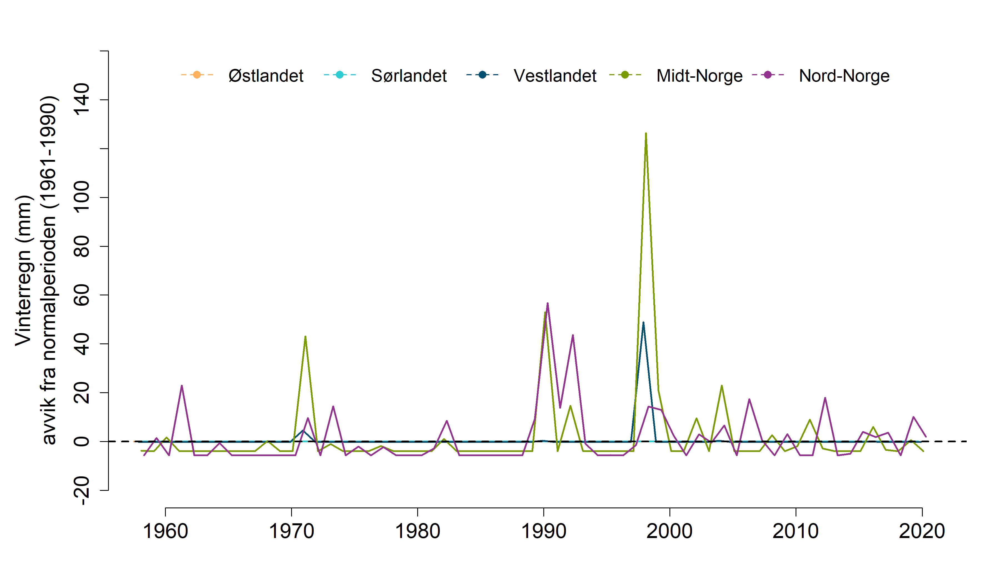

```{r setup, include=FALSE, message=FALSE}
library(knitr)
library(DT)
library(dplyr)
library(ggplot2)
library(readxl)
library(data.table)
knitr::opts_chunk$set(echo = TRUE)
```

# Import

```{r}
winterRain <- read_excel("P:/41201042_okologisk_tilstand_fastlandsnorge_2020_dataanaly/fjell2021/data/Klima/Vinterregn/winterRain_med.xlsx")
```

```{r}
winterRain$year <- as.numeric(winterRain$year)
winterRain$reg  <- as.factor(winterRain$reg)
```

```{r}
table(winterRain$reg)
```

```{r}
ref <- aggregate(data = 
      winterRain[winterRain$year %between% c(1961, 1990),],
                 value~reg,
                 FUN = mean)

upp <- aggregate(data = 
      winterRain[winterRain$year %between% c(1961, 1990),],
                 value~reg,
                 FUN = sd)
upp$value <- upp$value*2
ref$upp <- upp$value
rm(upp)
```

# Trender

```{r}
regOrder = c(
  "Nord-Norge",
  "Midt-Norge",
  "Østlandet",
  "Vestlandet",
   "Sørlandet"
             )
```

```{r}
ggplot(data = winterRain,
       aes(x = year, y = value))+
  geom_bar(stat="identity")+
  geom_hline(data = ref,
        aes(yintercept = value))+
  geom_hline(data = ref,
        aes(yintercept = upp),
        linetype=2)+
  theme_bw()+
  ylab("Vinterregn (mm)")+
  facet_wrap( .~ factor(reg, levels = regOrder),
              scales = "free_y",
              ncol=2)

```

Stipplalinja er 2sd og den heltrukne linja er gjennomsnittet (av forrige normalperioden).

Samme figur, men med log:
```{r}
ggplot(data = winterRain,
       aes(x = year, y = log(value+1)))+
  geom_bar(stat="identity")+
  geom_hline(data = ref,
        aes(yintercept = log(value+1)))+
  geom_hline(data = ref,
        aes(yintercept = log(upp+1)),
        linetype=2)+
  theme_bw()+
  ylab("log(Vinterregn (mm))+1")+
  ylim(c(0, 5))+
  facet_wrap( .~ factor(reg, levels = regOrder),
              ncol=2)

```

Vi kan også vise det som en avstand fra gjennomsnittet i referanseperioden.
```{r}
winterRain$ref <- ref$value[match(winterRain$reg, ref$reg)]
winterRain$diff <- winterRain$value-winterRain$ref

ref$upp2 <- ref$upp-ref$value
```

```{r}
#tempdat <- winterRain
#tempdat$var <- sign(tempdat$diff)*sqrt(abs(tempdat$diff))
#tempdat$col <- ifelse(tempdat$var<0, "one", "two")
winterRain$col <- ifelse(winterRain$diff<0, "one", "two")

ggplot(data = winterRain,
       aes(x = year, y = diff, fill = col))+
  geom_bar(stat="identity")+
  geom_hline(data = ref,
        aes(yintercept = upp),
        linetype=2)+
  scale_fill_hue(l=70, c=60)+
  theme_bw()+
  ylab("Vinterregn avvik fra 1961-1990 (mm)")+
  guides(fill="none")+
  facet_wrap( .~ factor(reg, levels = regOrder),
              ncol=2,
              scales = "free_y")

```
Det ble bedre tror jeg. men det er mange nuller i dette datasettet.
Det er uansett ingen endringer, men vi må fortsatt regne ut indikatorverdien. 

Bootstrapping (60% uten tilbakelegging) av gjennomsnittlig vinterregn siset 5 år. 
```{r}
new <- winterRain[winterRain$year %between% c(2016, 2020),]

regn <- data.frame(
  reg = rep(levels(winterRain$reg), each = 10000),
  year = 2020,
  val = NA)

for(n in levels(winterRain$reg)){
  temp <- new[new$reg==n,]
 for(i in 1:10000){
   regn$val[i+10000*(which(levels(winterRain$reg)==n)-1)] <- 
     mean(sample(temp$value, 3, replace=F))
 }
}
```

# Skalering
Når mengden vinterregn øker går den skalerte verdien mot null, og blir null når den når 5 sd fra normalperioden (ganske virkårlig bestemt). Da blir GØT samtidig satt til 2sd, noe som gir mening og kan tolkes som grensverdien for hva man ville kallt ekstremvær under forrige normalperiode. 

```{r}
regn$ref <- ref$value[match(regn$reg, ref$reg)]
regn$maks <- ref$upp[match(regn$reg, ref$reg)]*2.5


# trunkerer 
regn$valS <- ifelse(regn$val<regn$ref,
                    regn$ref,
                    regn$val)
regn$valS <- ifelse(regn$valS>regn$maks,
                    regn$maks,
                    regn$valS)

regn$valS <- 1-((regn$valS-regn$ref)/(regn$maks-regn$ref))
```

```{r}
ggplot(data=regn, aes(x = valS))+
  geom_histogram()+
  facet_wrap(.~reg)
```

```{r}
regn$valS[regn$reg=="Østlandet"] <- 1
```


# Arealvekting
```{r}
wgt <- readRDS("../data/fjellareal.rds")
wgt$Fjellareal2 <- wgt$Fjellareal/max(wgt$Fjellareal)
wgt$reg <- c("N", "C", "E", "W", "S")
```

```{r}
norge <- data.frame(
  reg = rep("Norge", 10000),
  year = 2020,
  val = NA,
  ref = NA,
  maks = NA,
  valS = NA
)

temp <- regn
    
temp2 <- c(
      sample(temp$valS[temp$reg == "Nord-Norge"], wgt$Fjellareal2[wgt$reg == "N"]*10000, replace =T),
      sample(temp$valS[temp$reg == "Østlandet"], wgt$Fjellareal2[wgt$reg == "E"]*10000, replace =T),
      sample(temp$valS[temp$reg == "Vestlandet"], wgt$Fjellareal2[wgt$reg == "W"]*10000, replace =T),
      sample(temp$valS[temp$reg == "Sørlandet"], wgt$Fjellareal2[wgt$reg == "S"]*10000, replace =T),
      sample(temp$valS[temp$reg == "Midt-Norge"], wgt$Fjellareal2[wgt$reg == "C"]*10000, replace =T)
    )

temp3 <- sample(temp2, 10000, replace = F)
norge$valS <- temp3
regn <- rbind(regn, norge)
```


# Plotting


```{r, warning=FALSE, eval=F}
regOrder2 <- c(regOrder, "Norge")
myPlot <- ggplot(data = regn, 
      aes(x = factor(reg, levels = regOrder2), 
          y = valS))+
  geom_boxplot(fill = "grey", lwd=1.2)+
  ylim(c(0,1))+
  ylab("Vinterregn skalert mot referanseverdi")+
  xlab("")+
  theme_bw(base_size = 20)+
  theme(
    axis.text.x = element_text(angle = 90, vjust = 0.5, hjust=1)
  )

png("../output/indicatorPlots/skalert/vinterregn_boxplot.png", 
    units="in", width=5, height=7, res=300)
myPlot
dev.off()
```

```{r}
ann_text <- data.frame(year = 1990,
                       diff = 0,
                       lab = "Vinterregn\nforekommer ikke",
                       reg = factor("Østlandet", levels = regOrder),
                       col = "one")
```


```{r, eval=F}

myPlot2 <- ggplot(data = winterRain,
       aes(x = year, y = diff, fill = col))+
  geom_bar(stat="identity")+
  geom_hline(data = ref,
        aes(yintercept = upp),
        linetype=2)+
  scale_fill_hue(l=70, c=60)+
  theme_bw(base_size = 20)+
  ylab("Vinterregn (mm)\navvik fra 1961-1990")+
  xlab("")+
  guides(fill="none")+
  geom_text(data = ann_text, aes(label = lab), size=8)+
  facet_wrap( .~ factor(reg, levels = regOrder),
              ncol=3,
              scales = "free_y")
```

```{r, eval=F}
png("../output/indicatorPlots/supporting figures/vinterregn_normalisert_barplot.png", 
    units="in", width=12, height=7, res=300)
myPlot2
dev.off()
```


# Forenkel figur i ØT-stil

```{r, echo=F}

Tbl <- aggregate(data=winterRain,
          diff~year+reg,
          FUN= function(x) round(
            quantile(x, c(.025, .5, .975)), 2))

Tbl <- do.call(data.frame, Tbl)
names(Tbl) <- c("year", "reg", "low", "diff", "upp")
```

```{r, eval=F}
regOrder = c("Østlandet","Sørlandet","Vestlandet","Midt-Norge","Nord-Norge")
Tbl <- Tbl[order(match(Tbl$reg,regOrder),Tbl$year),]
minyear <- 1958
maxyear <- 2021
upperYlimit <- 160
lowYlimit   <- -20
yStep <- 20
move <- 0.2
legendPosition <- "top"
legendInset = 0
horizontal = TRUE
legendTextSize = 1.25
colours = c("#2DCCD3", "#004F71", "#7A9A01", "#93328E", "#FFB25B")
# Create loop factors
  uniq1 <- unique(unlist(Tbl$year))
  uniq2 <- unique(unlist(Tbl$reg))
  
  
  ### PLOT first Norway
  
  # Subset for region 'E'
  Norge <- subset(Tbl, reg=="Østlandet")

png("../output/indicatorPlots/uskalert/vinterregn.png", 
    units="in", width=12, height=7, res=300)  
    par(mar=c(4.5,6.5,2,2))

 # Plot for region = 'Norge'
  plot(
    Norge$diff~Norge$year, 
    ylab="Vinterregn (mm)\navvik fra normalperioden (1961-1990)",
    xlab="",
    main="",
    xlim=c(minyear, maxyear),
    ylim=c(lowYlimit, upperYlimit),
    cex.main=1,
    cex.lab=1.5,
    cex.axis=1.5,
    type="n", 
    frame.plot=FALSE,
    axes=FALSE
  )
  
  # Axis 1 options
  axis(side=1, at=c(seq(1960, 2020, by=10)), cex.axis=1.5) 
  
  
  # Axis 2 options
  axis(side=2, at=seq(lowYlimit, upperYlimit, yStep), 
       labels=seq(lowYlimit, upperYlimit, yStep), 
       cex.axis=1.5)
  
  
  # Add lines
  lines(Norge$year+(move*(-2.5)), Norge$diff, col=colours[5], lwd=2, lty=1) 
  
  # Save temp points for later addition to plot
  temppoints <- data.frame(year = Norge$year, med = Norge$diff)
  
  
  
  # Empty temporary points data frame
  temppoints3 <- data.frame()
  
  
  
  ### Then plot loop per region
  for(n in 1:(length(uniq2)-1)){
    
    # Subset for region i
    quants <- subset(Tbl, reg==uniq2[n])
    
    # Add lines
    lines(quants$year+move*(n-2.5), quants$diff, col=colours[n], lwd=2, lty=1) 
    
    # Save temp points for later addition to plot
    temppoints2 <- data.frame(year = quants$year, med = quants$diff, reg = uniq2[n])
    temppoints3 <- rbind(temppoints3, temppoints2)
    
  }
  
 ## Add points for regions
 #for(n in 1:(length(uniq2)-1)){
 #  temppoints4 <- temppoints3[temppoints3$reg==uniq2[n],]
 #  points(temppoints4$year+move*(n-2.5),temppoints4$diff, pch=21, bg=colours[n], cex=1.5)
 #}
 #
 ## Add points for Norge
 #points(temppoints$year+(move*(-2.5)),temppoints$diff, pch=21, bg=colours[6], cex=1.5)
  
  # Add legend to plot
  legend(legendPosition, legendPositionY, legend = regOrder, col = c(colours[5], colours[1:4]), 
         #bg = c(colours), 
         pch=16, lty=2,
         lwd=1.5, bty="n", inset=legendInset, title="", horiz = horizontal,
         cex=legendTextSize)
  
  # add reference line
  abline(h=0, col="black", lwd=2, lty=2)

dev.off()
  
```


# Tabell

```{r, echo=F}

finalTbl <- aggregate(data=regn,
          valS~year+reg,
          FUN= function(x) round(
            quantile(x, c(.025, .5, .975)), 2))

finalTbl <- do.call(data.frame, finalTbl)
names(finalTbl) <- c("year", "reg", "low", "med", "upp")

DT::datatable(
  finalTbl, 
  extensions = "FixedColumns",
  options = list(
    scrollX = TRUE,
    scrollY=T,
    pageLength = 10
  ))
```

# Export csv
```{r, eval=F}
exp <- dplyr::select(regn, reg, year, val = valS)
write.csv(exp, "../output/indicator_values/vinterregn.csv", row.names = F)
```


